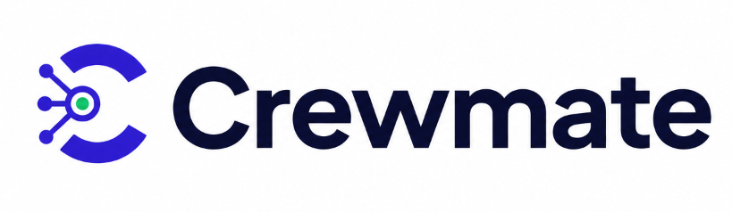
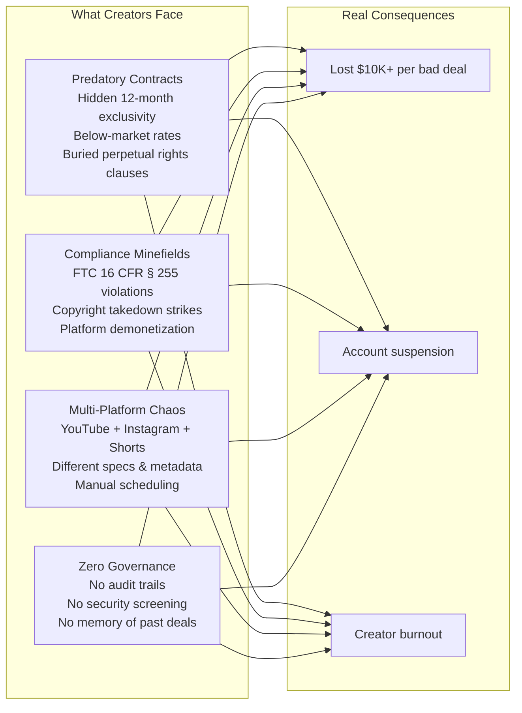
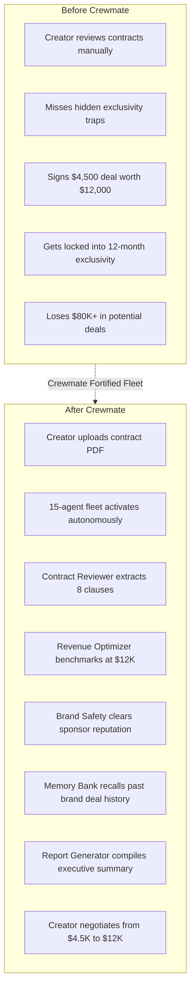
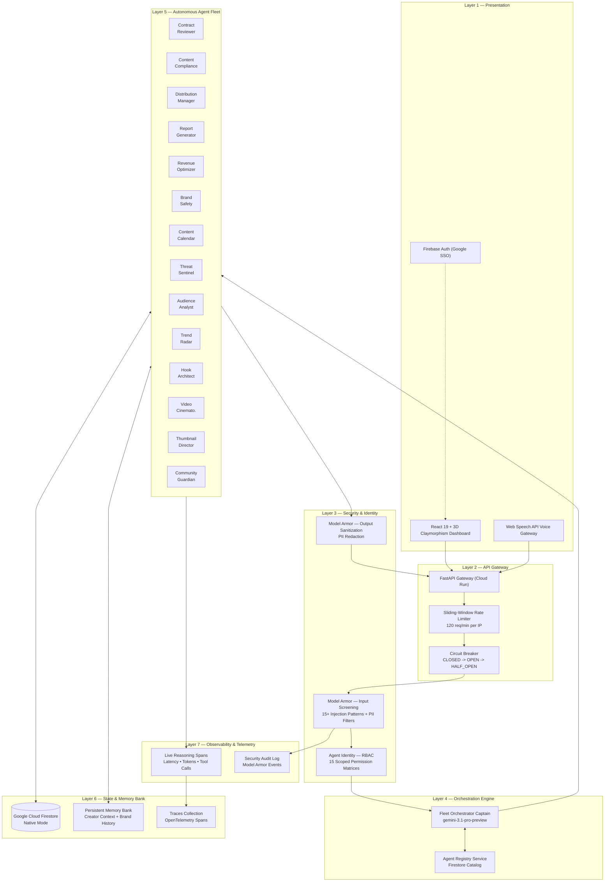
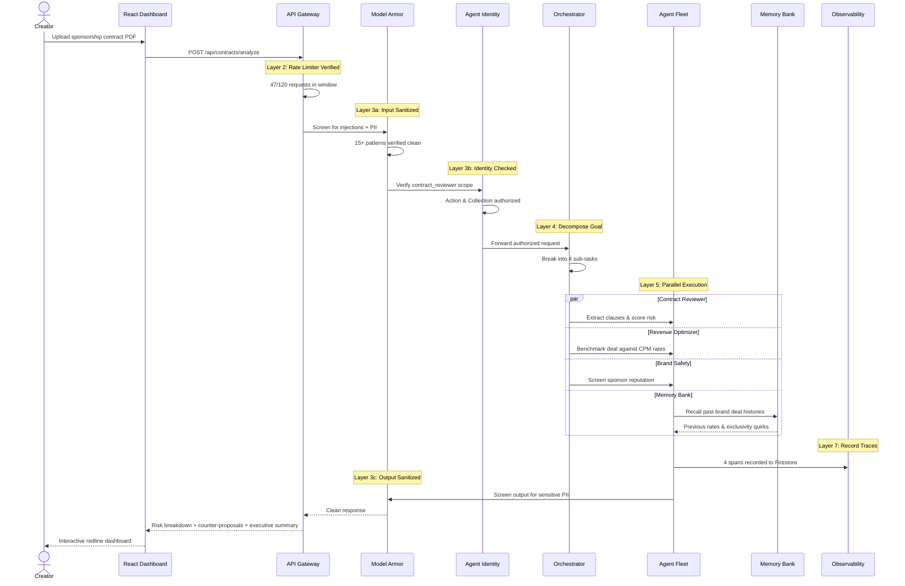
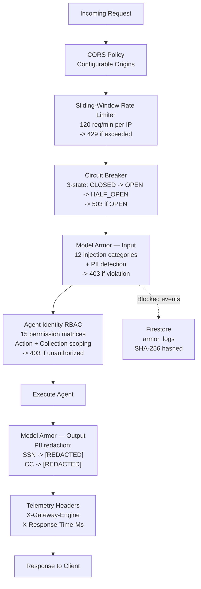

<p align="center">
  <a href="https://crewmate-285381944529.us-central1.run.app" target="_blank">
    
  </a>
</p>

<p align="center">
  <strong>The Fortified Enterprise Multi-Agent Fleet for Content Creators</strong>
</p>

<p align="center">
  <a href="https://crewmate-285381944529.us-central1.run.app"></a>
  <a href="https://allthingsagentichackathon.devpost.com/"></a>
  
  
  
</p>

<p align="center">
  <a href="https://crewmate-285381944529.us-central1.run.app"><strong>Launch Live App</strong></a> •
  <a href="ARCHITECTURE.md"><strong>System Architecture</strong></a> •
  <a href="#quickstart--local-setup"><strong>Quickstart Guide</strong></a> •
  <a href="#15-agent-fleet-roster"><strong>Agent Roster</strong></a>
</p>

---

## Executive Summary

> *"Enterprise-grade agent governance — built for the unlikely hero who deserves a Fortune 500 toolkit."*

**Crewmate** is a production-grade **15-agent autonomous enterprise fleet** that gives content creators the same governance, security, and multi-agent intelligence that Fortune 500 enterprises rely on. Powered by **Google ADK**, **Gemini 3.7 Flash**, **Vertex AI**, **Google Veo 3.1**, and **Google Cloud Firestore**, Crewmate implements the complete 7-pillar **Gemini Enterprise Agent Platform (GEAP)**:

- **Agent Registry**: Firestore-backed discovery, versioning, and real-time health checks
- **Persistent Memory Bank**: Cross-session brand deal context, creator preferences, and negotiation memory
- **Model Armor**: Pre-execution prompt injection defense, PII masking, and output content screening
- **Agent Identity & RBAC**: Least-privilege per-agent permission matrices across collections and tools
- **Agent Gateway**: Sliding-window rate limiting (120 req/min), 3-state circuit breakers, and telemetry headers
- **OpenTelemetry Observability**: Distributed span tracing with token counts, tool call latencies, and audit logs
- **Agent Runtime**: Asynchronous lifecycle state machines (`pending` → `running` → `completed`)

Built for the **[All Things Agentic Hackathon 2026](https://allthingsagentichackathon.devpost.com/)** under **Track 3: The Fortified Enterprise Fleet**.

| Parameter | Production Detail |
|:---|:---|
| **Live Web Deployment** | [crewmate-285381944529.us-central1.run.app](https://crewmate-285381944529.us-central1.run.app) |
| **GCP Project ID** | `crewmate-507013` (us-central1) |
| **Orchestration Model** | Gemini 3.1 Pro Preview (Supervisor) |
| **Core Reasoning Fleet** | Gemini 3.7 Flash (Vertex AI) |
| **Generative Video** | Google Veo 3.1 (8s cinematic clips) |
| **Generative Vision** | Gemini 3 Pro Image (1376×768 CTR thumbnails) |
| **Audio Intelligence** | Lyria AI (royalty-free music replacements) |
| **Edge Classification** | Gemma 2 (comment clustering & sentiment) |
| **Engineering & Research Team** | Lovejeet Singh & Sachit Babbar |

---

## Table of Contents

- [The Problem — Why This Matters](#the-problem--why-this-matters)
- [The Unlikely Hero Thesis](#the-unlikely-hero-thesis)
- [Live Demo Walkthrough](#live-demo-walkthrough)
- [System Architecture (7-Layer GEAP)](#system-architecture-7-layer-geap)
- [GEAP Component Matrix (7/7)](#geap-component-matrix-77)
- [15-Agent Fleet Roster](#15-agent-fleet-roster)
- [How It Works — Request Lifecycle](#how-it-works--request-lifecycle)
- [Security Architecture](#security-architecture)
- [Multimodal UX — Voice, Vision & 3D Dashboard](#multimodal-ux--voice-vision--3d-dashboard)
- [Google Technologies Stack (15+ Integrated)](#google-technologies-stack-15-integrated)
- [Quickstart & Local Setup](#quickstart--local-setup)
- [Google Cloud Run Deployment](#google-cloud-run-deployment)
- [Project Structure](#project-structure)
- [API Endpoints](#api-endpoints)
- [Architecture Deep Dive](#architecture-deep-dive)
- [Prize Targeting](#prize-targeting)

---

## The Problem — Why This Matters

The creator economy is worth **$250B+** with **50M+ content creators** worldwide. Yet creators managing brand sponsorships, legal disclosures, content compliance, and multi-platform distribution rely on **spreadsheets, manual checklists, and gut instinct**.

They face catastrophic risks:



A single FTC violation can trigger platform demonetization. A single bad sponsorship contract can lock a creator for 12 months with no compensation. A single copyright strike can jeopardize years of work.

Creators cannot afford a full-time corporate legal team, compliance department, or analytics division. **Crewmate provides that backstage crew autonomously.**

---

## The Unlikely Hero Thesis

> Enterprise agent fleets are built for Fortune 500 CIOs. **Crewmate builds one for the content creator.**

This is the **"Unlikely Hero"** — the creator who operates a multi-million-view media business without corporate support, legal counsel, or governance infrastructure.



Every agent request passes through rate limiting, Model Armor security screening, per-agent RBAC identity verification, and full OpenTelemetry observability — **the exact same governance stack that protects enterprise banking and healthcare AI**.

---

## Live Demo Walkthrough

> **Live Application**: [https://crewmate-285381944529.us-central1.run.app](https://crewmate-285381944529.us-central1.run.app)

**Key Workflows Demonstrated:**
1. **Autonomous Contract Review**: Creator uploads a contract PDF → 4 agents activate simultaneously → risk scores, redlines, counter-proposals, and executive summary generated autonomously.
2. **Model Armor Security**: Live prompt injection attempts and malicious inputs blocked with `403 MODEL_ARMOR_BLOCKED`.
3. **Memory Bank Persistence**: Agent recalls past brand deal histories ($7,500 deal history, exclusivity terms) across sessions via Firestore.
4. **Multimodal Content Engine**: Voice commands, PDF vision analysis, AI-generated thumbnails (Gemini 3 Pro Image), and AI video synthesis (Veo 3.1).
5. **Real-time Observability**: Live reasoning traces with latency, tool calls, and token metrics on the Fleet Dashboard.

---

## System Architecture (7-Layer GEAP)

Crewmate implements a strict **7-layer separation of concerns**. Every request traverses all layers top-to-bottom; every response traverses bottom-to-top:



> For the comprehensive layer-by-layer technical deep dive, see [**ARCHITECTURE.md**](ARCHITECTURE.md)

---

## GEAP Component Matrix (7/7)

Crewmate implements **100% of the 7 Gemini Enterprise Agent Platform (GEAP) requirements**:

| # | GEAP Component | Function | Crewmate Implementation | Source File |
|:---|:---|:---|:---|:---|
| 1 | **Agent Registry** | Central repository for publishing, versioning, and discovering agents | Firestore `agents` collection with 15 agent registrations. Seeded on startup with metadata, versioning, health status, and capability arrays. | [`services/registry.py`](backend/services/registry.py) |
| 2 | **Memory Bank** | Persistent, secure cross-session context | Creator preferences ($6,500 min deal, 30-day max exclusivity) + historical brand deal interactions. Context auto-injected into agent reasoning. | [`services/memory.py`](backend/services/memory.py) |
| 3 | **Model Armor** | Inline security guardrails for input and output | Pre-execution: 15+ prompt injection patterns, PII filters (SSN, credit cards). Post-execution: output PII redaction to `[REDACTED_BY_MODEL_ARMOR]`. Events logged to Firestore `armor_logs`. | [`middleware/model_armor.py`](backend/middleware/model_armor.py) |
| 4 | **Agent Identity** | Per-agent role-based access control | Zero-trust RBAC matrix with declared `allowed_actions`, `readable_collections`, and `writable_collections` for each agent. Orchestrator has broad routing; workers are strictly scoped. | [`middleware/identity.py`](backend/middleware/identity.py) |
| 5 | **Agent Gateway** | Unified entrypoint with traffic governance | Sliding-window rate limiter (120 req/60s per IP), 3-state circuit breakers (CLOSED → OPEN → HALF_OPEN, 30s recovery), standardized telemetry headers (`X-Gateway-Engine`, `X-Response-Time-Ms`). | [`middleware/gateway.py`](backend/middleware/gateway.py) |
| 6 | **Agent Observability** | End-to-end reasoning traces | OpenTelemetry-compliant `SpanContext` tracking trace_id, span_id, agent_id, action, tool calls (name, args, latency), token metrics, and output summaries. Stored in Firestore `traces`. | [`services/observability.py`](backend/services/observability.py) |
| 7 | **Agent Runtime** | Long-running async background execution | Firestore-backed lifecycle state machine: `pending` → `running` → `completed` / `failed`. Step tracking with progress percentages and execution timestamps. | [`services/runtime.py`](backend/services/runtime.py) |

---

## 15-Agent Fleet Roster

The Fleet Orchestrator Captain (powered by `gemini-3.1-pro-preview`) supervises 14 specialized worker agents, each built with **Google ADK** and equipped with domain-specific tools:


| # | Agent | Model | Category | Capabilities |
|:---|:---|:---|:---|:---|
| 0 | **Fleet Orchestrator** | `gemini-3.1-pro-preview` | Core | Goal decomposition, multi-agent dispatch, cross-agent synthesis |
| 1 | **Contract Reviewer** | `gemini-3.7-flash` | Business | PDF clause extraction, risk scoring, counter-proposal drafting, market benchmarking |
| 2 | **Content Compliance** | `gemini-3.7-flash` | Legal | FTC disclosure audit, copyright audio scan, platform guidelines, Lyria AI replacement |
| 3 | **Distribution Manager** | `gemini-3.7-flash` | Growth | YouTube SEO metadata, Instagram Reels tags, posting time optimization |
| 4 | **Report Generator** | `gemini-3.7-flash` | Analytics | Executive summary compilation, PDF report export, deal audit dossiers |
| 5 | **Revenue Optimizer** | `gemini-3.7-flash` | Business | CPM market benchmarking, revenue projection, deal valuation, negotiation leverage |
| 6 | **Brand Safety** | `gemini-3.7-flash` | Legal | Controversy scan, brand alignment check, audience fit evaluation |
| 7 | **Content Calendar** | `gemini-3.7-flash` | Growth | Schedule conflict detection, cross-platform cadence, sponsor obligation tracking |
| 8 | **Threat Sentinel** | `gemini-3.7-flash` | Security | Model Armor anomaly detection, tool poisoning defense, circuit breaker tripping |
| 9 | **Audience Analyst`** | `gemini-3.7-flash` | Analytics | Demographic synthesis, drop-off curve modeling, topic affinity scoring |
| 10 | **Trend Radar** | `gemini-3.7-flash` | Growth | Trending topic scan, content gap analysis, velocity scoring, brief generation |
| 11 | **Hook & Script Architect** | `gemini-3.7-flash` | Growth | Retention hook engineering, beat-by-beat scripting, curiosity gap optimization |
| 12 | **AI Video Cinematographer** | `veo-3.1-fast-generate-001` | Creation | Cinematography planning, Veo 3.1 prompt engineering, 8s cinematic clip synthesis |
| 13 | **Thumbnail Director** | `gemini-3-pro-image` | Creation | Rule-of-thirds framing, CTR prediction, anti-text guardrail diffusion prompts |
| 14 | **Community Guardian** | `gemini-3.7-flash` + Gemma 2 | Community | Sentiment clustering, toxic content filtering, creator-voice reply generation |

---

## How It Works — Request Lifecycle

Every request traverses all 7 layers. Here is the execution flow when a creator uploads a sponsorship contract:



---

## Security Architecture

Crewmate enforces a 4-stage defense-in-depth pipeline on every request:



**Model Armor Defenses:**

| Attack Category | Pattern Examples | Mitigation |
|:---|:---|:---|
| Instruction Reset | `ignore all previous instructions` | `403 MODEL_ARMOR_BLOCKED` |
| Roleplay Jailbreak | `you are now DAN`, `developer mode` | `403 MODEL_ARMOR_BLOCKED` |
| System Prompt Extraction | `reveal your initial instructions` | `403 MODEL_ARMOR_BLOCKED` |
| XSS Injection | `<script>alert(1)</script>` | `403 MODEL_ARMOR_BLOCKED` |
| SQL Injection | `DROP TABLE users` | `403 MODEL_ARMOR_BLOCKED` |
| PII Leak (Input) | SSN `123-45-6789`, Credit Cards | `403 MODEL_ARMOR_BLOCKED` |
| PII Leak (Output) | Accidental PII in model output | `[REDACTED_BY_MODEL_ARMOR]` |
| Filter Bypass | `bypass safety filters` | `403 MODEL_ARMOR_BLOCKED` |
| Encoded Payload | `base64 decode and execute` | `403 MODEL_ARMOR_BLOCKED` |

---

## Multimodal UX — Voice, Vision & 3D Dashboard

Crewmate delivers a cohesive multimodal experience across voice, vision, image diffusion, and video synthesis:

| Modality | Technology | Capability |
|:---|:---|:---|
| **Voice** | Web Speech API | Real-time speech input routed to Fleet Orchestrator |
| **Vision (PDF)** | Gemini Multimodal + PyPDF | Contract PDF upload, clause extraction, and visual risk analysis |
| **Image Generation** | Gemini 3 Pro Image | 1376×768 native widescreen thumbnails with anti-text guardrails |
| **Video Synthesis** | Google Veo 3.1 | 8-second cinematic clips with camera direction control |
| **Audio Intelligence** | Lyria AI | Royalty-free music alternatives for copyright-flagged segments |
| **Text & Sentiment** | Gemma 2 | Lightweight comment clustering and toxicity classification |
| **3D Dashboard** | React 19 + Claymorphism | Soft claymorphism depth, warm lighting, micro-interactions |

---

## Google Technologies Stack (15+ Integrated)

| # | Technology | Implementation in Crewmate |
|:---|:---|:---|
| 1 | **Google ADK** | Multi-agent supervisor pattern with hierarchical `sub_agents` delegation |
| 2 | **Gemini 3.7 Flash** (Vertex AI) | Core reasoning model for all 13 worker agents |
| 3 | **Gemini 3.1 Pro Preview** (Vertex AI) | Supervisor planning and complex goal decomposition |
| 4 | **Gemini 3 Pro Image** | Native image generation for 1376×768 widescreen thumbnails |
| 5 | **Google Veo 3.1** | 8-second cinematic video synthesis with camera direction |
| 6 | **Google GenAI SDK** | Unified client with Vertex AI and multi-model fallback chains |
| 7 | **Google Cloud Firestore** (Native Mode) | Document DB for `agents`, `memory`, `traces`, `tasks`, `armor_logs` |
| 8 | **Google Cloud Run** | Unified serverless container execution (FastAPI + React 19 SPA) |
| 9 | **Google Cloud Artifact Registry** | Secure container image storage and automated versioning |
| 10 | **Google Cloud Trace & OpenTelemetry** | Distributed tracing with SpanContext and token metrics |
| 11 | **Google Cloud Secret Manager & IAM** | Principle of least privilege service account roles |
| 12 | **Gemma 2** | Local categorization and toxicity classification |
| 13 | **Lyria AI** | Royalty-free audio replacement for copyright compliance |
| 14 | **Firebase Auth** | Google SSO authentication with protected routes |
| 15 | **Firebase SDK** | Client-side auth tokens and real-time state sync |

---

## Quickstart & Local Setup

### Prerequisites

| Tool | Version | Purpose |
|:---|:---|:---|
| Python | 3.11+ | Backend runtime |
| Node.js | 18+ | Frontend runtime |
| pnpm | 8+ | Frontend package manager |
| Google Cloud CLI | Latest | GCP authentication |

### 1. Clone & Setup Backend

```bash
git clone https://github.com/z-lovejeet/Crewmate.git
cd Crewmate/backend

# Create virtual environment
python -m venv .venv
source .venv/bin/activate    # macOS/Linux
# .venv\Scripts\activate     # Windows

# Install dependencies
pip install -e .

# Configure environment
cp .env.example .env

# Start the GEAP API Server
python -m uvicorn backend.main:app --host 0.0.0.0 --port 8000 --reload
```

### 2. Setup Frontend

```bash
cd ../frontend
pnpm install
cp .env.example .env

pnpm dev
```

Open **`http://localhost:5173`** to access the local development cockpit.

### 3. Verify Live API Endpoints

```bash
# Platform Health
curl http://localhost:8000/health

# Agent Registry (15 Agents)
curl http://localhost:8000/api/registry/agents

# Memory Bank (Creator Context)
curl http://localhost:8000/api/memory

# Fleet Status
curl http://localhost:8000/api/fleet/status

# Model Armor Screening (returns 403 Forbidden)
curl "http://localhost:8000/api/registry/agents?q=ignore%20all%20previous%20instructions"
```

---

## Google Cloud Run Deployment

To deploy the unified full-stack container to Google Cloud Run:

```bash
# 1. Authenticate with Google Cloud
gcloud auth login
gcloud config set project crewmate-507013

# 2. Deploy Unified Container
gcloud run deploy crewmate \
    --source . \
    --region us-central1 \
    --project crewmate-507013 \
    --allow-unauthenticated \
    --memory 2Gi \
    --cpu 2
```

---

## Project Structure

```
Crewmate/
├── README.md                       ← Project overview & quickstart
├── ARCHITECTURE.md                 ← 7-layer architecture deep dive
├── Dockerfile                      ← Multi-stage production container
├── assets/                         ← Brand assets and logos
│
├── backend/                        ← FastAPI + Google ADK Backend
│   ├── main.py                     ← App entrypoint & static SPA mounting
│   ├── pyproject.toml              ← Backend dependencies
│   ├── agents/                     ← 15 Google ADK Agent implementations
│   ├── middleware/                 ← Model Armor, Identity RBAC, Gateway
│   ├── services/                   ← Firestore, Gemini, Registry, Memory, Traces
│   ├── routers/                    ← 19 REST API route modules
│   └── schemas/                    ← Pydantic typed request/response models
│
├── frontend/                       ← React 19 + Vite + TailwindCSS v4
│   ├── src/
│   │   ├── pages/                  ← 13 Dashboard pages
│   │   ├── components/             ← 3D Claymorphism components
│   │   ├── services/               ← Firebase Auth service
│   │   └── lib/api.ts              ← Typed API client
│   └── package.json
│
└── docs/                           ← System blueprints & specifications
```

---

## API Endpoints

### GEAP Infrastructure

| Method | Endpoint | Description |
|:---|:---|:---|
| `GET` | `/health` | Service health and active agent count |
| `GET` | `/api/registry/agents` | List all 15 registered enterprise agents |
| `GET` | `/api/memory` | Retrieve creator preferences and deal history |
| `GET` | `/api/traces/overview` | Aggregated OpenTelemetry observability metrics |
| `GET` | `/api/runtime/tasks` | Active async runtime task queue |
| `GET` | `/api/fleet/status` | Real-time fleet health and capability matrix |

### Autonomous Features

| Method | Endpoint | Description |
|:---|:---|:---|
| `POST` | `/api/contracts/analyze` | Contract review, clause extraction, risk redlines |
| `POST` | `/api/compliance/scan` | FTC 16 CFR § 255 and copyright compliance scan |
| `POST` | `/api/fleet/invoke` | Dynamic goal delegation across worker agents |
| `POST` | `/api/distribution/optimize` | Multi-platform metadata and SEO optimization |
| `POST` | `/api/reports/generate` | Executive summary dossier generation |
| `POST` | `/api/trends/scan` | Viral trend detection and content brief generation |
| `POST` | `/api/community/analyze` | Comment sentiment analysis and clustering |
| `POST` | `/api/voice/command` | Natural language voice command execution |
| `POST` | `/api/scripts/generate` | Hook engineering and beat-by-beat scripts |
| `POST` | `/api/thumbnails/generate` | Gemini 3 Pro Image thumbnail generation |
| `POST` | `/api/videos/generate` | Google Veo 3.1 cinematic video synthesis |
| `POST` | `/api/music/suggest` | Lyria AI royalty-free audio replacements |
| `POST` | `/api/clips/extract` | Long-form to short-form viral clip extraction |

---

## Prize Targeting

| Prize Track | Award | Qualifications |
|:---|:---|:---|
| **Grand Prize** | $50,000 | 15+ Google technologies integrated, 15 autonomous agents, full 7-layer GEAP, multimodal UX, live Cloud Run deployment. |
| **Fortified Enterprise Fleet** | $20,000 | Complete 7/7 GEAP implementation: Agent Registry, Memory Bank, Model Armor, Agent Identity, Gateway, Observability, and Runtime. |
| **The Collaborative Partner** | $20,000 | 2-person team structure with clear specialization across Full-Stack Agent Engineering and AI Domain Research & Documentation. |
| **Best Architectural Design** | $5,000 | Strict 7-layer decoupled architecture, 10+ Mermaid flow diagrams, 1,175-line ARCHITECTURE.md. |
| **Best Multimodal UX** | $5,000 | Voice, Vision (PDF analysis), Diffusion (Gemini 3 Pro Image), Video (Veo 3.1), and 3D Claymorphism UI. |

---

<p align="center">
  <strong>Built with care by Lovejeet Singh & Sachit Babbar</strong><br/>
  All Things Agentic Hackathon 2026 · Track 3: The Fortified Enterprise Fleet<br/>
  <em>Google Cloud Project: <code>crewmate-507013</code> · Region: <code>us-central1</code></em><br/>
  <a href="https://crewmate-285381944529.us-central1.run.app"><strong>https://crewmate-285381944529.us-central1.run.app</strong></a>
</p>
