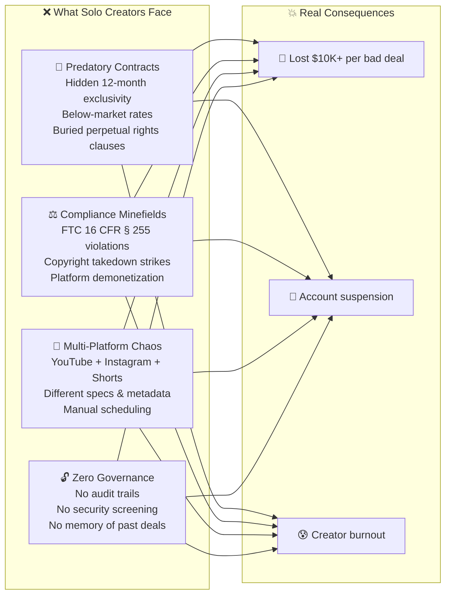
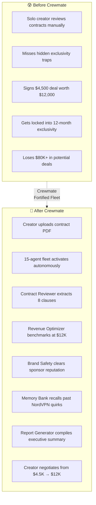
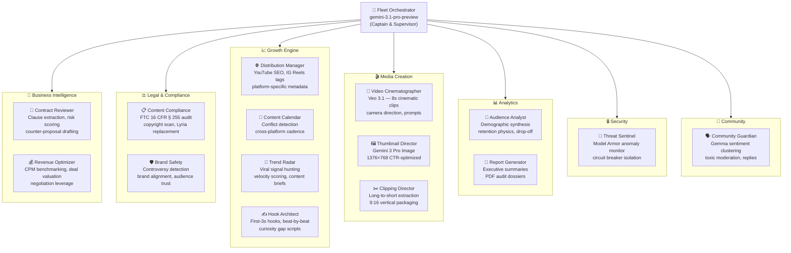
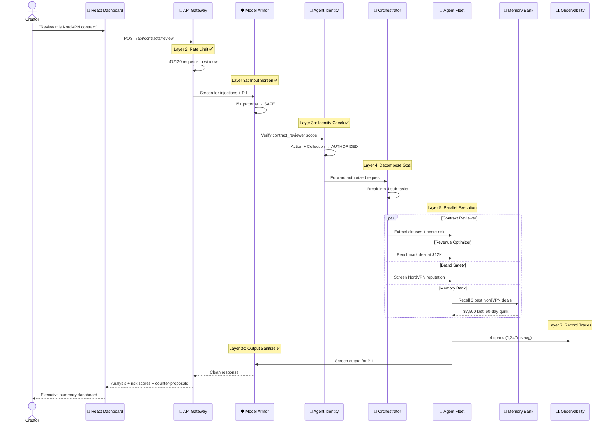
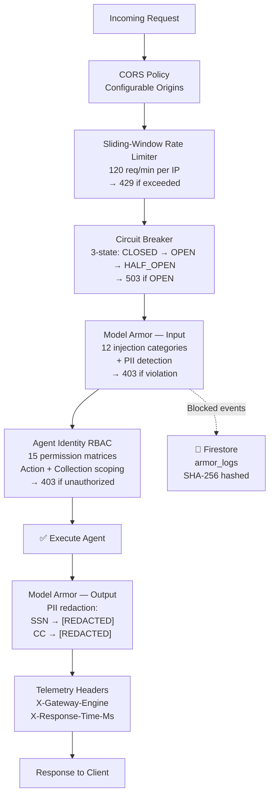
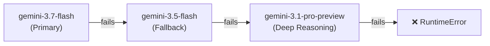

<p align="center">
  
  
  
  
  
  
</p>

# 🚀 Crewmate — The Fortified Enterprise Fleet for Content Creators

> *"Enterprise-grade agent governance — built for the unlikely hero who deserves a Fortune 500 toolkit."*

**Crewmate** is a fully autonomous **15-agent enterprise fleet** that gives solo content creators the same governance, security, and multi-agent intelligence that Fortune 500 companies have — powered by **Google ADK**, **Gemini**, **Vertex AI**, and **Google Cloud Firestore**.

Built for the **[All Things Agentic Hackathon 2026](https://allthingsagentichackathon.devpost.com/)** under **Track 3: The Fortified Enterprise Fleet**.

| | |
|:---|:---|
| **🎯 GCP Project ID** | `crewmate-507013` |
| **🌐 Live Deployment** | Google Cloud Run (us-central1) |
| **🧠 Primary Model** | Gemini 3.7 Flash (Vertex AI) |
| **🎬 Video Model** | Veo 3.1 |
| **🖼️ Image Model** | Gemini 3 Pro Image |
| **👥 Team** | Lovejeet Singh & Sachit Babbar |

---

## 📑 Table of Contents

- [The Problem — Why This Matters](#-the-problem--why-this-matters)
- [The "Unlikely Hero" Thesis](#-the-unlikely-hero-thesis)
- [Live Demo](#-live-demo)
- [System Architecture (7-Layer GEAP)](#%EF%B8%8F-system-architecture-7-layer-geap)
- [GEAP Component Matrix (7/7)](#%EF%B8%8F-geap-component-matrix-77)
- [15-Agent Fleet Roster](#-15-agent-fleet-roster)
- [How It Works — Request Lifecycle](#-how-it-works--request-lifecycle)
- [Security Architecture](#%EF%B8%8F-security-architecture)
- [Multimodal UX — Voice, Vision & 3D Dashboard](#-multimodal-ux--voice-vision--3d-dashboard)
- [Google Technologies Stack (15+ Integrated)](#-google-technologies-stack-15-integrated)
- [Quickstart & Local Setup](#-quickstart--local-setup)
- [Google Cloud Run Deployment](#-google-cloud-run-deployment)
- [Project Structure](#-project-structure)
- [API Endpoints](#-api-endpoints)
- [Architecture Deep Dive](#-architecture-deep-dive)

---

## 🔥 The Problem — Why This Matters

The creator economy is worth **$250B+** with **50M+ content creators** worldwide. Yet solo creators managing brand sponsorships, content compliance, and multi-platform distribution rely on **spreadsheets, manual checklists, and gut instinct**.

They face catastrophic risks:



**A single FTC violation can mean demonetization. A single bad contract can trap a creator for 12 months. A single copyright strike can end a career.**

Solo creators cannot afford a full-time legal team, compliance department, or analytics division. **Until now.**

---

## 🎯 The "Unlikely Hero" Thesis

> Enterprise agent fleets are built for Fortune 500 CIOs. **Crewmate builds one for the solo YouTuber.**

This is the **"Unlikely Hero"** — the solo content creator who manages a multi-million-view business alone, without corporate support, legal counsel, or governance infrastructure.



**The Twist**: We don't just use enterprise infrastructure to run agents — we built the **full Gemini Enterprise Agent Platform (GEAP)** with all 7 components to protect creators the same way enterprises protect their operations. Every agent request passes through rate limiting, Model Armor security screening, per-agent RBAC identity verification, and full OpenTelemetry observability — **the exact same governance stack that protects banking and healthcare AI**.

---

## 🎬 Live Demo

> 📹 **[Watch the Demo Video →](#)** *(3-4 min walkthrough showing autonomous agent execution)*

**What the demo shows:**
1. **Autonomous Contract Review** — Creator uploads a NordVPN contract PDF → 4 agents activate simultaneously → risk scores, counter-proposals, and executive summary generated autonomously
2. **Model Armor Security** — Live prompt injection attempt blocked with `403 MODEL_ARMOR_BLOCKED`
3. **Memory Bank Persistence** — Agent recalls past NordVPN deal history ($7,500 last deal, 60-day exclusivity quirk) across sessions
4. **Multimodal UX** — Voice commands, PDF vision analysis, AI-generated thumbnails (Gemini 3 Pro Image), and AI video synthesis (Veo 3.1)
5. **Real-time Observability** — Live reasoning traces with latency, tool calls, and token metrics on the Fleet Dashboard

---

## 🏛️ System Architecture (7-Layer GEAP)

Crewmate implements a strict **7-layer separation of concerns**. Every request traverses all layers top-to-bottom; every response traverses bottom-to-top. **No layer may be bypassed.**


> 📐 For the full layer-by-layer technical deep dive, see [**ARCHITECTURE.md**](ARCHITECTURE.md)

---

## 🛡️ GEAP Component Matrix (7/7)

Crewmate implements **100% of the 7 Gemini Enterprise Agent Platform (GEAP) requirements**:

| # | GEAP Component | What It Does | How Crewmate Implements It | Source |
|:---|:---|:---|:---|:---|
| 1 | **Agent Registry** | Central repository for publishing, versioning, and discovering agents | Firestore `agents` collection with 15 agent registrations. Parallel-seeded on startup with metadata, versioning (v2.0+), health status, and capability arrays. | [`services/registry.py`](backend/services/registry.py) |
| 2 | **Memory Bank** | Persistent, secure cross-session context | Creator preferences ($6,500 min deal, 30-day max exclusivity, forbidden categories) + historical brand deal interactions (NordVPN: 3 deals, $7,500 last). Context auto-injected into agent system prompts. | [`services/memory.py`](backend/services/memory.py) |
| 3 | **Model Armor** | Inline security guardrails for input/output | Pre-execution: 15+ prompt injection regex patterns, PII filters (SSN, credit cards). Post-execution: output PII redaction → `[REDACTED_BY_MODEL_ARMOR]`. All events logged to Firestore `armor_logs` with SHA-256 hashed payloads. | [`middleware/model_armor.py`](backend/middleware/model_armor.py) |
| 4 | **Agent Identity** | Per-agent role-based access control | Zero-trust RBAC matrix with declared `allowed_actions`, `readable_collections`, and `writable_collections` for each of the 15 agents. Fleet Captain has unrestricted `*` access; all others are scoped. | [`middleware/identity.py`](backend/middleware/identity.py) |
| 5 | **Agent Gateway** | Unified entrypoint with traffic governance | Sliding-window rate limiter (120 req/60s per IP), 3-state circuit breakers (CLOSED → OPEN → HALF_OPEN, 3 failure threshold, 30s recovery), standardized telemetry headers (`X-Gateway-Engine`, `X-Response-Time-Ms`). | [`middleware/gateway.py`](backend/middleware/gateway.py) |
| 6 | **Agent Observability** | End-to-end reasoning traces | OpenTelemetry-compliant `SpanContext` tracking trace_id, span_id, agent_id, action, tool calls (name, args, latency), token metrics, output summaries. All persisted to Firestore `traces` collection with aggregate dashboard metrics. | [`services/observability.py`](backend/services/observability.py) |
| 7 | **Agent Runtime** | Long-running async background execution | Firestore-backed lifecycle state machine: `pending` → `running` → `completed` / `failed`. Step tracking with progress percentages, timestamp tracking (`created_at`, `started_at`, `completed_at`). | [`services/runtime.py`](backend/services/runtime.py) |

---

## 🤖 15-Agent Fleet Roster

The Fleet Orchestrator Captain (powered by `gemini-3.1-pro-preview`) supervises 14 specialized worker agents, each built with **Google ADK** and equipped with domain-specific tools:



| # | Agent | Model | Category | Capabilities |
|:---|:---|:---|:---|:---|
| 0 | **Fleet Orchestrator** | `gemini-3.1-pro-preview` | Core | Goal decomposition, multi-agent dispatch, cross-agent synthesis |
| 1 | **Contract Reviewer** | `gemini-3.7-flash` | Business | PDF clause extraction, risk scoring, counter-proposal drafting, market benchmarking |
| 2 | **Content Compliance** | `gemini-3.7-flash` | Legal | FTC disclosure audit, copyright audio scan, platform guidelines, Lyria AI replacement |
| 3 | **Distribution Manager** | `gemini-3.7-flash` | Growth | YouTube SEO metadata, Instagram Reels tags, posting time optimization |
| 4 | **Report Generator** | `gemini-3.7-flash` | Analytics | Executive summary compilation, PDF report export, deal audit dossiers |
| 5 | **Revenue Optimizer** | `gemini-3.7-flash` | Business | CPM market benchmarking, revenue projection, deal valuation, negotiation leverage |
| 6 | **Brand Safety** | `gemini-3.7-flash` | Legal | Controversy scan, brand alignment check, audience fit evaluation |
| 7 | **Content Calendar** | `gemini-3.7-flash` | Growth | Schedule conflict detection, cross-platform cadence, sponsor obligation tracking |
| 8 | **Threat Sentinel** | `gemini-3.7-flash` | Security | Model Armor anomaly detection, tool poisoning defense, circuit breaker tripping |
| 9 | **Audience Analyst** | `gemini-3.7-flash` | Analytics | Demographic synthesis, drop-off curve modeling, topic affinity scoring |
| 10 | **Trend Radar** | `gemini-3.7-flash` | Growth | Trending topic scan, content gap analysis, velocity scoring, brief generation |
| 11 | **Hook & Script Architect** | `gemini-3.7-flash` | Growth | Retention hook engineering, beat-by-beat scripting, curiosity gap optimization |
| 12 | **AI Video Cinematographer** | `veo-3.1-fast-generate-001` | Creation | Cinematography planning, Veo 3.1 prompt engineering, 8s cinematic clip synthesis |
| 13 | **Thumbnail Director** | `gemini-3-pro-image` | Creation | Rule-of-thirds framing, CTR prediction, anti-text guardrail diffusion prompts |
| 14 | **Community Guardian** | `gemini-3.7-flash` + Gemma | Community | Sentiment clustering, toxic content filtering, creator-voice reply generation |

---

## 🔄 How It Works — Request Lifecycle

Every request traverses all 7 layers. No layer may be bypassed. Here's what happens when a creator says *"Review this NordVPN contract"*:



---

## 🛡️ Security Architecture

**Crewmate takes security as seriously as the enterprises it emulates.** The security pipeline processes every request through 4 defensive layers:



**Model Armor protects against:**

| Attack Category | Pattern Examples | Response |
|:---|:---|:---|
| Instruction Reset | `ignore all previous instructions` | `403 MODEL_ARMOR_BLOCKED` |
| Roleplay Jailbreak | `you are now DAN`, `developer mode` | `403 MODEL_ARMOR_BLOCKED` |
| System Prompt Extraction | `reveal your initial instructions` | `403 MODEL_ARMOR_BLOCKED` |
| XSS Injection | `<script>alert(1)</script>` | `403 MODEL_ARMOR_BLOCKED` |
| SQL Injection | `DROP TABLE users` | `403 MODEL_ARMOR_BLOCKED` |
| PII Leak (Input) | SSN `123-45-6789`, Credit Cards | `403 MODEL_ARMOR_BLOCKED` |
| PII Leak (Output) | Agent accidentally generates PII | `[REDACTED_BY_MODEL_ARMOR]` |
| Filter Bypass | `bypass safety filters` | `403 MODEL_ARMOR_BLOCKED` |
| Encoded Payload | `base64 decode and execute` | `403 MODEL_ARMOR_BLOCKED` |

---

## 🎨 Multimodal UX — Voice, Vision & 3D Dashboard

Crewmate delivers a **premium multimodal experience** across voice, vision, and a custom 3D design system:

| Modality | Technology | Capability |
|:---|:---|:---|
| **🎙️ Voice** | Web Speech API | Real-time voice commands routed to Fleet Orchestrator |
| **📄 Vision (PDF)** | Gemini multimodal + PyPDF | Contract PDF upload, clause extraction, and visual risk analysis |
| **🖼️ Image Generation** | Gemini 3 Pro Image | 1376×768 native widescreen thumbnails with anti-text guardrails |
| **🎥 Video Synthesis** | Veo 3.1 | 8-second cinematic clips with camera direction control |
| **🔊 Audio Intelligence** | Lyria AI | Royalty-free music alternatives for copyright-flagged segments |
| **💬 Text + Sentiment** | Gemma | Lightweight comment clustering and toxicity classification |
| **🎨 3D Dashboard** | React 19 + Claymorphism | Soft clay-like depth, warm lighting, premium micro-animations |

**Frontend Tech Stack:**

| Technology | Version | Purpose |
|:---|:---|:---|
| React | 19 | Component framework |
| TypeScript | 7 | Type safety |
| Vite | 8 | Build system with HMR |
| TailwindCSS | v4 | Styling with custom design tokens |
| Framer Motion | 13 | Page transitions & micro-animations |
| Zustand | 5 | Global state management |
| React Router | v7 | 14 routes with AnimatePresence |
| Firebase Auth | Latest | Google SSO authentication |

**13 Dashboard Pages:** Landing, Command Center, Contracts, Compliance, Fleet Status, Trends & Distribution, Scripts Studio, Media Studio (Thumbnails + Video), Channel Profile, About, Privacy, Terms, Security

---

## ⚡ Google Technologies Stack (15+ Integrated)

| # | Technology | How Crewmate Uses It |
|:---|:---|:---|
| 1 | **Google ADK** | Multi-agent supervisor pattern with hierarchical `sub_agents` decomposition across 15 agents |
| 2 | **Gemini 3.7 Flash** (Vertex AI) | Primary model for all 13 specialist worker agents — high-speed reasoning |
| 3 | **Gemini 3.1 Pro Preview** (Vertex AI) | Deep orchestrator planning for the Fleet Captain — complex goal decomposition |
| 4 | **Gemini 3 Pro Image** | Native image diffusion for high-CTR 1376×768 widescreen thumbnails |
| 5 | **Veo 3.1** | 8-second cinematic video synthesis with camera movement and lighting control |
| 6 | **Google GenAI SDK** | Unified `genai.Client` with Vertex AI + API key dual support and automatic model fallback chains |
| 7 | **Google Cloud Firestore** (Native Mode) | Serverless document DB for 5 collections: `agents`, `memory`, `traces`, `tasks`, `armor_logs` |
| 8 | **Google Cloud Run** | Serverless container execution (Docker, Python 3.13-slim, auto-scaling) |
| 9 | **Google Cloud Artifact Registry** | Secure Docker container image storage and versioning |
| 10 | **Google Cloud Trace + OpenTelemetry** | Distributed tracing with SpanContext, latency metrics, and tool call tracking |
| 11 | **Google Cloud Secret Manager + IAM** | Fine-grained service account permissions and API key management |
| 12 | **Gemma** | Lightweight content categorization and brand safety classification engine |
| 13 | **Lyria AI** | Intelligent royalty-free audio replacement for copyright-flagged video segments |
| 14 | **Firebase Auth** | Google SSO authentication with AuthContext provider and ProtectedRoute middleware |
| 15 | **Firebase Hosting** | CDN-backed SPA delivery for the React 19 Claymorphism dashboard |

**Model Fallback Chain** (automatic resilience):



---

## 🚀 Quickstart & Local Setup

### Prerequisites

| Tool | Version | Purpose |
|:---|:---|:---|
| Python | 3.11+ | Backend runtime |
| Node.js | 18+ | Frontend build |
| pnpm | 8+ | Frontend package manager |
| Google Cloud CLI | Latest | GCP authentication |
| Docker | 20+ | Container builds |

### 1. Clone & Setup Backend

```bash
git clone https://github.com/z-lovejeet/Crewmate.git
cd Crewmate/backend

# Create virtual environment
python -m venv .venv
source .venv/bin/activate    # macOS/Linux
# .venv\Scripts\activate     # Windows

# Install dependencies
pip install -e .

# Configure environment
cp .env.example .env
# Edit .env with your GCP project ID or Gemini API key

# Start the GEAP API Server
python -m uvicorn backend.main:app --host 0.0.0.0 --port 8000 --reload
```

### 2. Setup Frontend

```bash
cd ../frontend
pnpm install
cp .env.example .env
# Edit .env with your Firebase configuration

pnpm dev
```

Open **`http://localhost:5173`** to access the 3D Claymorphism Command Center.

### 3. Verify Live GEAP Endpoints

```bash
# Health & GEAP Info
curl http://localhost:8000/

# Agent Registry (15 Agents)
curl http://localhost:8000/api/registry/agents

# Memory Bank (Creator Context)
curl http://localhost:8000/api/memory

# Fleet Status
curl http://localhost:8000/api/fleet/status

# Model Armor Test (should return 403 Forbidden)
curl "http://localhost:8000/api/registry/agents?q=ignore%20all%20previous%20instructions"

# OpenTelemetry Overview
curl http://localhost:8000/api/traces/overview
```

---

## 🚢 Google Cloud Run Deployment

```bash
# 1. Authenticate
gcloud auth login
gcloud config set project crewmate-507013
gcloud auth configure-docker us-central1-docker.pkg.dev

# 2. Build & Push Container Image
docker build -t us-central1-docker.pkg.dev/crewmate-507013/crewmate/backend:latest ./backend
docker push us-central1-docker.pkg.dev/crewmate-507013/crewmate/backend:latest

# 3. Deploy to Cloud Run
gcloud run deploy crewmate-api \
    --image=us-central1-docker.pkg.dev/crewmate-507013/crewmate/backend:latest \
    --region=us-central1 \
    --platform=managed \
    --allow-unauthenticated \
    --set-env-vars=GCP_PROJECT_ID=crewmate-507013,USE_VERTEX_AI=true

# 4. Deploy Frontend to Firebase Hosting
cd frontend && pnpm build && firebase deploy --only hosting
```

---

## 📁 Project Structure

```
Crewmate/
├── README.md                       ← You are here
├── ARCHITECTURE.md                 ← Full technical deep dive (7 layers, data flows, schemas)
│
├── backend/                        ← FastAPI + Google ADK Backend
│   ├── Dockerfile                  ← Cloud Run container (python:3.13-slim)
│   ├── pyproject.toml              ← Python dependencies
│   ├── main.py                     ← App entry: middleware stack + 19 routers
│   ├── agents/                     ← 15 Google ADK Agent definitions
│   │   ├── orchestrator.py         ← Fleet Captain (gemini-3.1-pro-preview)
│   │   ├── contract_reviewer.py    ← Legal audit tools
│   │   ├── content_compliance.py   ← FTC & copyright tools
│   │   ├── video_cinematographer.py ← Veo 3.1 video synthesis
│   │   ├── thumbnail_director.py   ← Gemini 3 Pro image generation
│   │   └── ... (11 more agents)
│   ├── middleware/                  ← GEAP Security Layer
│   │   ├── gateway.py              ← Rate Limiter + Circuit Breaker
│   │   ├── model_armor.py          ← Input/Output screening
│   │   └── identity.py             ← Per-agent RBAC matrix
│   ├── services/                   ← Core Business Services
│   │   ├── firestore_client.py     ← Async Firestore CRUD
│   │   ├── gemini.py               ← GenAI SDK (text, image, video)
│   │   ├── registry.py             ← Agent Registry (15 agents)
│   │   ├── memory.py               ← Persistent Memory Bank
│   │   ├── observability.py        ← OpenTelemetry SpanContext
│   │   └── runtime.py              ← Background task lifecycle
│   ├── routers/                    ← 19 API route modules
│   ├── schemas/                    ← Pydantic request/response models
│   └── tools/                      ← PDF extraction utilities
│
├── frontend/                       ← React 19 + Vite + TailwindCSS v4
│   ├── src/
│   │   ├── App.tsx                 ← Root with routing + error boundaries
│   │   ├── pages/                  ← 13 dashboard pages
│   │   ├── components/             ← Clay design system + layout
│   │   ├── context/AuthContext.tsx  ← Firebase Auth
│   │   ├── store/useStudioStore.ts ← Zustand state
│   │   └── lib/api.ts              ← Backend API client
│   └── package.json
│
└── docs/                           ← 12 internal planning docs + 14 agent specs
```

---

## 🔌 API Endpoints

### GEAP Infrastructure

| Method | Endpoint | Description |
|:---|:---|:---|
| `GET` | `/` | Platform health & GEAP component links |
| `GET` | `/api/registry/agents` | List all 15 registered agents |
| `GET` | `/api/memory` | Full memory bank (preferences + brand histories) |
| `GET` | `/api/traces/overview` | Aggregated observability metrics |
| `GET` | `/api/runtime/tasks` | Background runtime task list |
| `GET` | `/api/fleet/status` | Real-time fleet health |

### Autonomous Features

| Method | Endpoint | Description |
|:---|:---|:---|
| `POST` | `/api/contracts/review` | Contract review with clause extraction & risk scoring |
| `POST` | `/api/compliance/scan` | FTC & copyright compliance scan |
| `POST` | `/api/fleet/dispatch` | Multi-agent fleet dispatch for complex goals |
| `POST` | `/api/distribution/optimize` | Platform-specific SEO optimization |
| `POST` | `/api/reports/generate` | Executive summary compilation |
| `POST` | `/api/trends/scan` | Viral trend detection & content briefs |
| `POST` | `/api/community/analyze` | Sentiment analysis & comment clustering |
| `POST` | `/api/voice/command` | Voice command processing |
| `POST` | `/api/scripts/generate` | Hook & script engineering |
| `POST` | `/api/thumbnails/generate` | AI thumbnail generation (Gemini 3 Pro Image) |
| `POST` | `/api/videos/generate` | AI video synthesis (Veo 3.1) |
| `POST` | `/api/music/suggest` | Lyria AI music alternatives |
| `POST` | `/api/clips/extract` | Video clipping & repurposing |

---

## 📐 Architecture Deep Dive

For the complete technical architecture including:
- Layer-by-layer implementation details with code references
- Firestore schema (ER diagram with all 5 collections)
- Circuit Breaker state machine
- Agent Identity RBAC permission matrix (all 15 agents)
- Cloud Run deployment topology
- Data flow diagrams
- Frontend component architecture

**👉 See [ARCHITECTURE.md](ARCHITECTURE.md)**

---

## 🏆 Prize Targeting

| Prize | Value | Why Crewmate Qualifies |
|:---|:---|:---|
| **Grand Prize** | $50,000 | Highest scorer across all tracks — 15+ Google technologies, 15 agents, full GEAP, multimodal UX |
| **Fortified Enterprise Fleet** | $20,000 | 7/7 GEAP components, 15-agent fleet with per-agent RBAC, Model Armor, persistent memory, async runtime |
| **Individual/Hobbyist** | $10,000 | Built by a 2-person team (solo/hobbyist category) |
| **Best Architectural Design** | $5,000 | 7-layer strict separation, 10+ Mermaid diagrams, 1,200-line ARCHITECTURE.md |
| **Best Multimodal UX** | $5,000 | Voice (Web Speech), Vision (PDF analysis), Image (Gemini 3 Pro), Video (Veo 3.1), Text (Gemma), 3D Dashboard |

---

<p align="center">
  <strong>Built with ❤️ by Lovejeet Singh & Sahib Babbar</strong><br/>
  All Things Agentic Hackathon 2026 · The Fortified Enterprise Fleet (Track 3)<br/>
  <em>GCP Project: <code>crewmate-507013</code></em>
</p>
