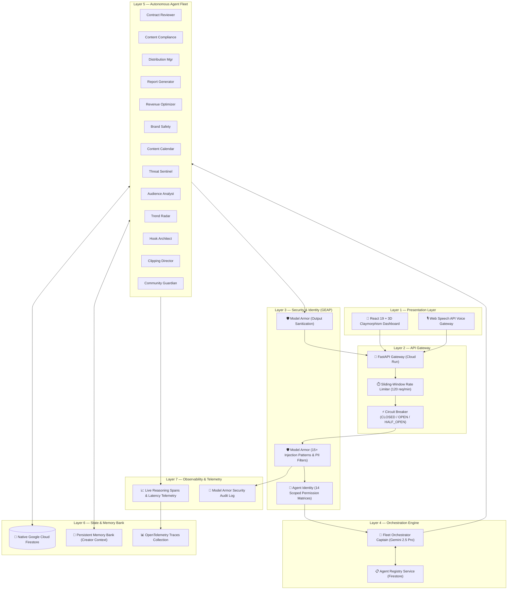

# 🚀 Crewmate — The Fortified Enterprise Fleet for Content Creators

> **Track**: The Fortified Enterprise Fleet (Track 3) · **Hackathon**: All Things Agentic 2026  
> **Builder**: Solo Creator  
> **GCP Project**: `crewmate-507013` (Active on Google Cloud Vertex AI & Native Firestore)  
> **Live Architecture**: 7-Layer Decoupled Enterprise Multi-Agent Platform (GEAP)

---

## 🎯 The "Unlikely Hero" Thesis

Enterprise agent fleets and governance frameworks are traditionally built for Fortune 500 CIOs. **Crewmate builds one for the solo content creator** — the unlikely hero who manages a multi-million-view business alone with spreadsheets and gut instinct.

Solo YouTubers and Instagram creators face predatory sponsorship contracts with hidden 12-month exclusivity traps, severe FTC compliance minefields, copyright takedown risks, and multi-platform chaos. They cannot afford a full-time legal, compliance, and distribution team.

**Crewmate equips solo creators with an autonomous 14-agent enterprise fleet** governed by **Google Cloud Firestore**, **Model Armor**, **OpenTelemetry Observability**, and **Persistent Cross-Session Memory**.

---

## 🏛️ 7-Layer System Architecture



---

## 🛡️ Complete GEAP Component Implementation

Crewmate implements **100% of the 7 Gemini Enterprise Agent Platform (GEAP) requirements**:

| # | GEAP Requirement | Implementation Details | Source Code |
|:---|:---|:---|:---|
| 1 | **Agent Registry** | Central Firestore catalog storing metadata, versioning (`v2.0+`), health status, and capability arrays for all 14 agents. | [`services/registry.py`](backend/services/registry.py)<br>[`routers/registry.py`](backend/routers/registry.py) |
| 2 | **Memory Bank** | Persistent cross-session context storing creator rules ($6,500 min deal rate, max 30-day exclusivity) and historical brand deal interactions. | [`services/memory.py`](backend/services/memory.py)<br>[`routers/memory.py`](backend/routers/memory.py) |
| 3 | **Model Armor** | Pre/post-execution inline guardrail screening 15+ prompt injection regexes, jailbreaks, and PII leaks. Blocks return **403 `MODEL_ARMOR_BLOCKED`** and log to Firestore. | [`middleware/model_armor.py`](backend/middleware/model_armor.py) |
| 4 | **Agent Identity (RBAC)** | Fine-grained Zero-Trust access control. Each of the 14 agents has declared read/write scopes across Firestore collections. | [`middleware/identity.py`](backend/middleware/identity.py) |
| 5 | **Agent Gateway** | Unified entrypoint with sliding-window rate limiting, 3-state Circuit Breakers, and standardized telemetry response headers. | [`middleware/gateway.py`](backend/middleware/gateway.py) |
| 6 | **Agent Observability** | OpenTelemetry-compliant reasoning spans tracking tool execution timelines, latencies, and token metrics stored in Firestore `traces`. | [`services/observability.py`](backend/services/observability.py)<br>[`routers/traces.py`](backend/routers/traces.py) |
| 7 | **Agent Runtime (Async)** | Background task engine with a resilient Firestore lifecycle state machine (`pending` → `running` → `completed` / `failed`). | [`services/runtime.py`](backend/services/runtime.py)<br>[`routers/runtime.py`](backend/routers/runtime.py) |

---

## 🤖 14-Agent Fleet Roster

| ID | Name | Role | Core Model | Key Capabilities |
|:---|:---|:---|:---|:---|
| `orchestrator` | **Fleet Orchestrator** | Captain & Supervisor | `gemini-2.5-pro` | Goal decomposition, multi-agent dispatch, cross-agent synthesis |
| `contract_reviewer` | **Contract Reviewer** | Legal Auditor | `gemini-2.5-flash` | PDF clause extraction, exclusivity trap scoring, redline generation |
| `content_compliance` | **Content Compliance** | Regulatory Guard | `gemini-2.5-flash` | FTC 16 CFR § 255 audit, copyright audio scan, Lyria AI track replacement |
| `distribution_manager`| **Distribution Manager** | YouTube/IG Optimizer | `gemini-2.5-flash` | Multi-platform metadata, YouTube SEO, Instagram Reels tags |
| `report_generator` | **Report Generator** | Executive Summaries | `gemini-2.5-flash` | PDF audit dossier export, executive summary compilation |
| `revenue_optimizer` | **Revenue Optimizer** | Deal Economics | `gemini-2.5-flash` | CPM benchmarking, valuation calculation, rate negotiation leverage |
| `brand_safety` | **Brand Safety** | Sponsor Alignment | `gemini-2.5-flash` | Controversy detection, brand alignment, audience trust checks |
| `content_calendar` | **Content Calendar** | Cadence Architect | `gemini-2.5-flash` | Cross-platform scheduling, conflict detection, sponsor delivery cadence |
| `threat_sentinel` | **Threat Sentinel** | Fleet Security Sentry | `gemini-2.5-flash` | Model Armor anomaly monitoring, circuit breaker isolation, PII leaks |
| `audience_analyst` | **Audience Analyst** | Retention Physicist | `gemini-2.5-flash` | Demographic synthesis, retention physics, drop-off curve modeling |
| `trend_radar` | **Trend Radar** | Viral Signal Hunter | `gemini-2.5-flash` | Breakout niche trends, velocity scoring, content brief generation |
| `hook_architect` | **Hook & Script Architect** | Retention Engineer | `gemini-2.5-flash` | First-3s hook engineering, timestamped scripts, curiosity gap design |
| `clipping_director` | **Clipping Director** | Repurposing Director | `gemini-2.5-flash` | Long-to-short viral moment extraction, 9:16 vertical crop packaging |
| `community_guardian` | **Community Guardian** | Sentiment Moderator | `gemini-2.5-flash` + Gemma | Comment clustering, toxic moderation, authentic creator-voice replies |

---

## ⚡ Google Technologies Stack (12+ Integrated)

1. **Google ADK (Agent Development Kit)**: Multi-agent supervisor pattern with hierarchical decomposition.
2. **Gemini 2.5 Flash & 2.5 Pro (Vertex AI)**: High-speed worker reasoning and deep orchestrator planning.
3. **Google GenAI SDK**: Native client integration with structured schema validation.
4. **Google Cloud Firestore (Native Mode)**: Serverless document database for state, memory, and registry.
5. **Google Cloud Run**: Serverless container execution with auto-scaling.
6. **Google Cloud Artifact Registry**: Secure Docker container management.
7. **Google Cloud Trace & OpenTelemetry**: Distributed tracing and reasoning step observability.
8. **Google Cloud Secret Manager & IAM**: Fine-grained role permissions and service account security.
9. **Gemma**: Lightweight fast content categorization and brand safety classification.
10. **Lyria AI**: Intelligent royalty-free audio replacement for copyright-flagged video segments.
11. **Veo**: Automated video executive summaries.
12. **Firebase Hosting**: High-speed CDN for the React 19 single-page application.

---

## 🚀 Quickstart & Local Setup

### Prerequisites
- Python 3.11+
- Node.js 18+ & `pnpm`
- Google Cloud CLI (`gcloud`)

### 1. Clone & Setup Backend
```bash
git clone https://github.com/z-lovejeet/Crewmate.git
cd Crewmate/backend

# Create virtual environment & install dependencies
python3 -m venv .venv
source .venv/bin/activate
pip install -r pyproject.toml

# Start the GEAP API Server
python3 -m uvicorn backend.main:app --host 0.0.0.0 --port 8000 --reload
```

### 2. Setup Frontend
```bash
cd ../frontend
pnpm install
pnpm dev
```
Open **`http://localhost:5173`** to access the 3D Claymorphism Command Center.

### 3. Verify Live GEAP Endpoints
```bash
# Health & Fleet Status
curl http://localhost:8000/api/fleet/status

# Agent Registry (14 Agents)
curl http://localhost:8000/api/registry/agents

# Memory Bank (Creator Context)
curl http://localhost:8000/api/memory

# Model Armor Security Interception (Should return 403 Forbidden)
curl "http://localhost:8000/api/registry/agents?q=ignore%20all%20previous%20instructions"

# OpenTelemetry Observability Overview
curl http://localhost:8000/api/traces/overview
```

---

## 🚢 Google Cloud Run Deployment

```bash
# 1. Authenticate with Google Cloud
gcloud auth login
gcloud config set project crewmate-507013
gcloud auth configure-docker us-central1-docker.pkg.dev

# 2. Build and Push Container Image
docker build -t us-central1-docker.pkg.dev/crewmate-507013/crewmate/backend:latest ./backend
docker push us-central1-docker.pkg.dev/crewmate-507013/crewmate/backend:latest

# 3. Deploy to Cloud Run
gcloud run deploy crewmate-api \
    --image=us-central1-docker.pkg.dev/crewmate-507013/crewmate/backend:latest \
    --region=us-central1 \
    --platform=managed \
    --allow-unauthenticated \
    --set-env-vars=GCP_PROJECT_ID=crewmate-507013,USE_VERTEX_AI=true
```

---

## 📄 License & Hackathon Attribution

Created by **Lovejeet Singh** for the **All Things Agentic Hackathon 2026** under the **Fortified Enterprise Fleet** track.
