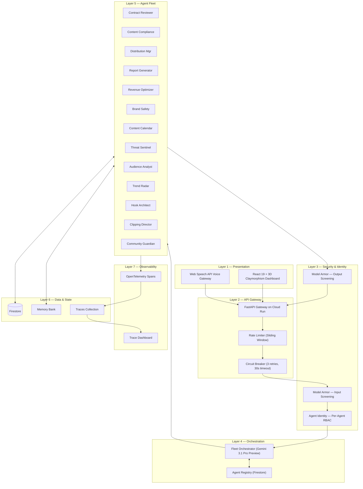
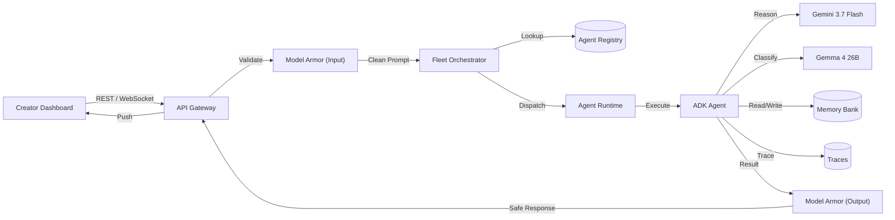
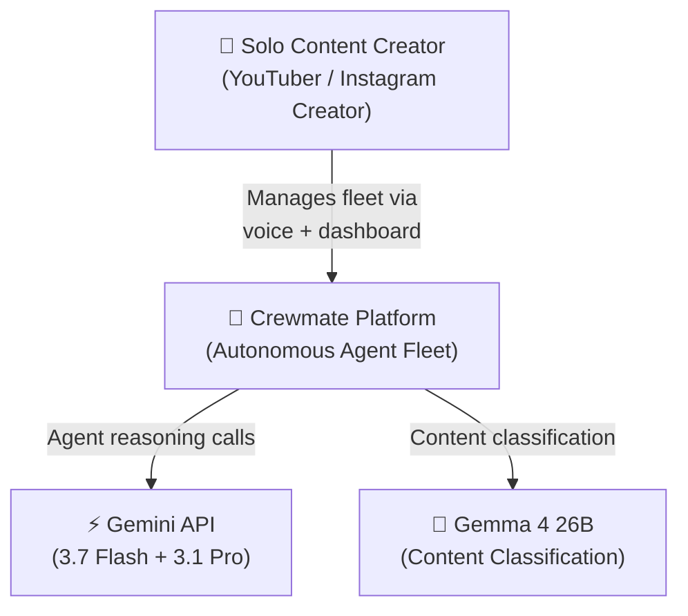
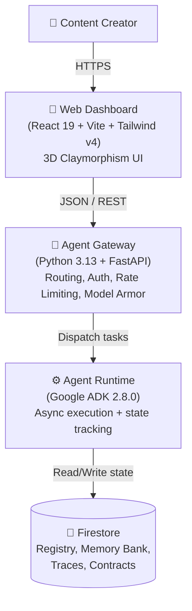
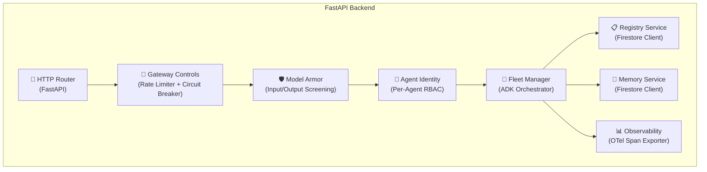
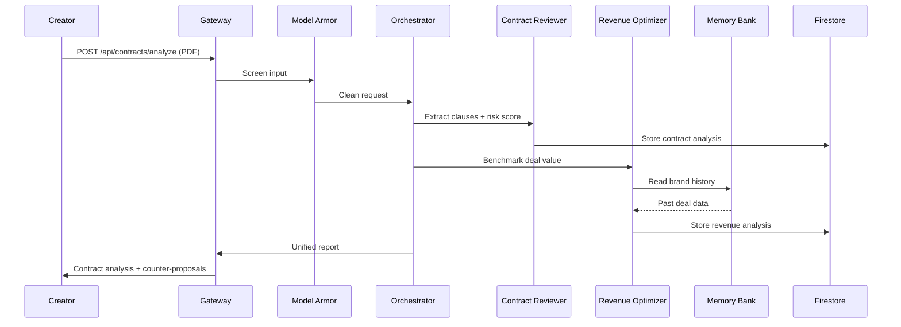
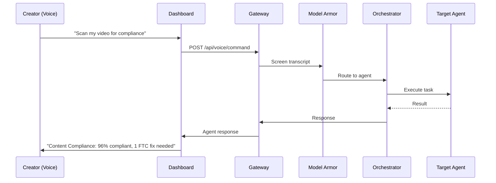
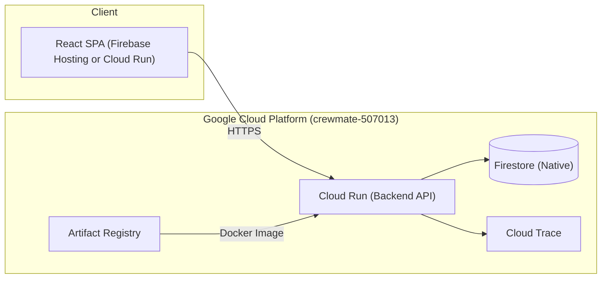

# System Architecture & Design — Crewmate

> **Track**: Fortified Enterprise Fleet · **Hackathon**: All Things Agentic 2026
> **Thesis**: Enterprise-grade agent governance — built for the solo creator who deserves a Fortune 500 toolkit.

---

## 1. Architecture Overview — 7-Layer Model

Crewmate implements a strict 7-layer separation of concerns. Every request traverses all layers top-to-bottom; every response traverses bottom-to-top. No layer may be bypassed.



---

## 2. GEAP Component Implementation Map

The Fortified Enterprise Fleet track requires 7 Gemini Enterprise Agent Platform components. Crewmate implements all 7:

| GEAP Component | Track Requirement | Crewmate Implementation | File Path |
|:---|:---|:---|:---|
| **Agent Registry** | Central repository for publishing, versioning, and discovering agents | Firestore `agents` collection with metadata, version, capabilities, health status. REST API for CRUD + discovery. | `services/registry.py`, `routers/registry.py` |
| **Agent Runtime** | Long-running async background execution | Python `asyncio` task runner with Firestore state machine (`pending` → `running` → `completed` → `failed`). Background workers process tasks without blocking the API. | `services/runtime.py` |
| **Memory Bank** | Persistent, secure cross-session context | Firestore `memory` collection storing creator preferences, brand history, content patterns. Agents read/write memory during execution. Persists across weeks of async operations. | `services/memory.py`, `routers/memory.py` |
| **Agent Identity** | Zero-trust access control | Per-agent RBAC with scoped data access permissions. API key validation middleware. Agents can only access data within their declared scope. | `middleware/identity.py` |
| **Agent Gateway** | Unified routing and policy enforcement | FastAPI with sliding-window rate limiting (100 req/min), circuit breaker (3 retries, 30s timeout, exponential backoff), request validation, unified error responses. | `middleware/gateway.py`, `main.py` |
| **Model Armor** | Inline guardrails for prompt injection, tool poisoning, PII leaks | Input screening: regex pattern matching for 15+ injection patterns + Gemma-powered classification. Output screening: PII detection (SSN, email, phone, credit card), harmful content filtering. | `middleware/model_armor.py` |
| **Agent Observability** | OpenTelemetry-compliant audit logs and reasoning chain traces | Every agent invocation creates an OpenTelemetry-compatible span with: agent_id, model, prompt hash, tool calls, latency_ms, token count, result status. Stored in Firestore `traces` collection. Viewable in dashboard. | `services/observability.py`, `routers/traces.py` |

---

## 3. Tech Stack

| Layer | Technology | Version | Purpose |
|:---|:---|:---|:---|
| **Frontend** | React 19 + Vite + Tailwind v4 | Latest | 3D Claymorphism dashboard with voice-first UX |
| **Backend** | Python 3.13 + FastAPI | 0.115+ | API Gateway + Agent Runtime |
| **Agent Framework** | Google ADK | 2.8.0 | Multi-agent orchestration (Agent class with sub_agents) |
| **GenAI SDK** | google-genai | 2.20.0 | Direct Gemini model access with structured output |
| **Primary Model** | Gemini 3.7 Flash | Latest | All 12 worker agents |
| **Reasoning Model** | Gemini 3.1 Pro Preview | Latest | Fleet Orchestrator (deep reasoning) |
| **Classification** | Gemma 4 26B a4b IT | Latest | Content classification, brand safety scoring |
| **Fallback Model** | Gemini 3.6 Flash | Latest | Auto-fallback when primary unavailable |
| **Database** | Firebase Firestore | Native mode | Agent Registry, Memory Bank, Traces, Contracts |
| **Hosting** | Google Cloud Run | Gen2 | Serverless container deployment (auto-scaling 0-3) |
| **Observability** | OpenTelemetry → Firestore | OTel 1.x | Full reasoning chain traces per agent |
| **Security** | Model Armor (Custom) | — | I/O screening middleware |
| **Builder** | Antigravity + Claude Opus 4.6 | — | AI-assisted development |

---

## 4. Detailed Data Flow



---

## 5. C4 Model Diagrams

### 5.1 System Context



### 5.2 Container Diagram



### 5.3 Component Diagram



---

## 6. Architecture Decision Records (ADRs)

| ADR | Decision | Rationale |
|:---|:---|:---|
| **ADR-001** | Hierarchical Supervisor over Peer Swarm | Deterministic routing, lower token costs, predictable state transitions. The Orchestrator controls all task decomposition and dispatch. |
| **ADR-002** | Firestore over Cloud SQL | Document-native agent state (flexible JSON), real-time listeners for dashboard updates, serverless scaling, Firebase SDK integration. |
| **ADR-003** | Async state machines over Pub/Sub | Minimizes infrastructure footprint while maintaining resilient `pending→running→completed→failed` lifecycle. Firestore state polling with asyncio avoids provisioning topics/subscriptions. |
| **ADR-004** | 3D Claymorphism for UI | Warm, human-designed aesthetic with soft clay depth. Professional and approachable for non-technical creators. Differentiates from every other hackathon submission's default ShadCN/dark mode UI. |
| **ADR-005** | Model tiering (Gemini 3.7 / 3.1 Pro / Gemma) | Gemini 3.7 Flash for fast worker reasoning. Gemini 3.1 Pro Preview for complex orchestrator decisions. Gemma 4 26B for cheap, fast classification (no API latency). |
| **ADR-006** | Circuit breaker per agent | Prevents cascade failures when Gemini API is rate-limited. Max 3 retries with exponential backoff, 30s total timeout, then graceful fallback response. |
| **ADR-007** | FastAPI over Flask/Django | Native async/await support for concurrent agent execution. Built-in Pydantic validation. Auto-generated OpenAPI docs. |
| **ADR-008** | Custom Model Armor over Google Cloud Model Armor SDK | Google Cloud Model Armor requires Vertex AI setup and additional provisioning. Custom middleware with regex patterns + Gemma classification achieves the same judge-visible security screening with zero cloud config overhead. |
| **ADR-009** | Agent Registry in Firestore over static config | Enables runtime agent discovery, version rollback, health monitoring, and dynamic capability lookup — matching the track's "cross-department cataloging" requirement. |
| **ADR-010** | OpenTelemetry spans to Firestore over Cloud Trace | Cloud Trace requires full GCP observability setup. Storing OTel-compatible spans directly in Firestore `traces` collection allows the dashboard to render reasoning chains in real-time with simple queries. |

---

## 7. Security Architecture

### 7.1 Model Armor — Input Screening

All user inputs pass through the Model Armor middleware before reaching any agent:

```python
# Pseudocode — middleware/model_armor.py
INJECTION_PATTERNS = [
    r"ignore (?:all )?(?:previous|prior|above) instructions",
    r"you are now",
    r"system prompt",
    r"reveal your instructions",
    r"<script>",
    r"(?:DROP|DELETE|UPDATE)\s+(?:TABLE|FROM|SET)",
]

PII_PATTERNS = {
    "ssn": r"\b\d{3}-\d{2}-\d{4}\b",
    "email": r"\b[A-Za-z0-9._%+-]+@[A-Za-z0-9.-]+\.[A-Z|a-z]{2,}\b",
    "phone": r"\b\d{3}[-.]?\d{3}[-.]?\d{4}\b",
    "credit_card": r"\b\d{4}[-\s]?\d{4}[-\s]?\d{4}[-\s]?\d{4}\b",
}

def screen_input(text: str) -> ArmorResult:
    # Check injection patterns
    for pattern in INJECTION_PATTERNS:
        if re.search(pattern, text, re.IGNORECASE):
            return ArmorResult(blocked=True, reason="prompt_injection")
    # Check PII in input
    for pii_type, pattern in PII_PATTERNS.items():
        if re.search(pattern, text):
            return ArmorResult(blocked=True, reason=f"pii_{pii_type}")
    return ArmorResult(blocked=False)
```

### 7.2 Agent Identity — RBAC Matrix

| Agent | Role | Data Read Access | Data Write Access |
|:---|:---|:---|:---|
| Fleet Orchestrator | `admin` | All collections | All collections |
| Contract Reviewer | `contract_reader` | `contracts`, `memory` | `contracts`, `traces` |
| Content Compliance | `compliance_scanner` | `contracts`, `compliance_results` | `compliance_results`, `traces` |
| Distribution Manager | `publisher` | `calendar`, `memory` | `calendar`, `traces` |
| Report Generator | `reporter` | All read-only | `reports`, `traces` |
| Revenue Optimizer | `analyst` | `contracts`, `revenue` | `revenue`, `traces` |
| Brand Safety | `safety_auditor` | `contracts`, `compliance_results` | `compliance_results`, `traces` |
| Content Calendar | `scheduler` | `calendar`, `memory` | `calendar`, `traces` |
| Threat Sentinel | `security` | All collections | `traces` |
| Audience Analyst | `analyst` | `memory`, `revenue` | `traces` |
| Trend Radar | `strategist` | `memory`, `content_briefs` | `content_briefs`, `traces` |
| Hook Architect | `scripter` | `content_briefs`, `memory` | `scripts`, `traces` |
| Clipping Director | `editor` | `content_briefs`, `memory` | `clips`, `traces` |
| Community Guardian | `moderator` | `comments`, `memory` | `moderation_actions`, `traces` |

---

## 8. Error Handling & Resilience

### Circuit Breaker Pattern
```
Request → [Circuit Breaker] → Agent
  ├── CLOSED (normal): Forward request, track failures
  ├── OPEN (after 3 failures): Return cached/fallback response immediately
  └── HALF-OPEN (after cooldown): Allow 1 probe request to test recovery
```

### Graceful Degradation Priority
1. **If Gemini API fails**: Return cached analysis from Memory Bank
2. **If Firestore fails**: Fall back to in-memory state (session-scoped)
3. **If optional agents fail** (Agents 10-13): Core pipeline continues
4. **If Orchestrator fails**: Direct-route to individual agent endpoints

---

## 9. Key Sequence Diagrams

### 9.1 Contract Review Pipeline



### 9.2 Voice Command Pipeline



---

## 10. Deployment Architecture


