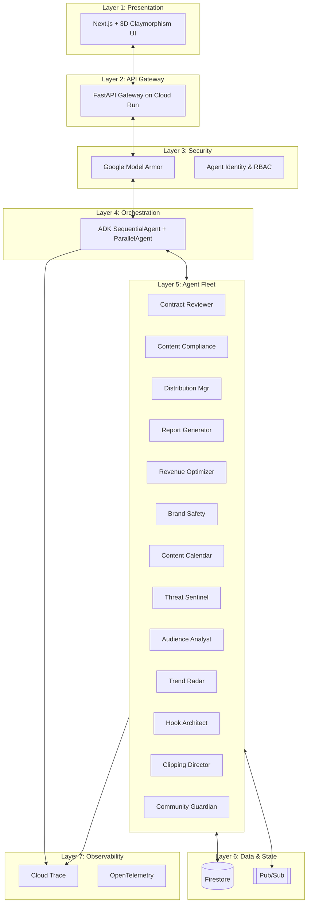
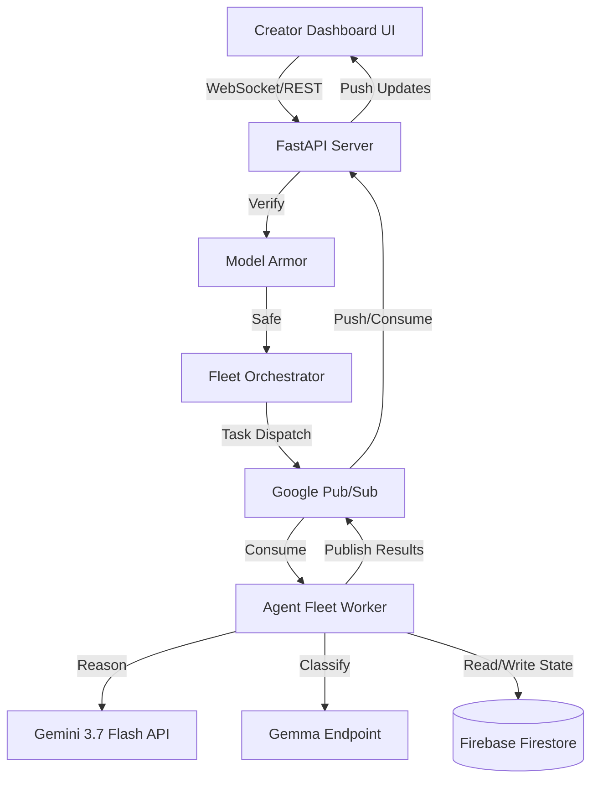
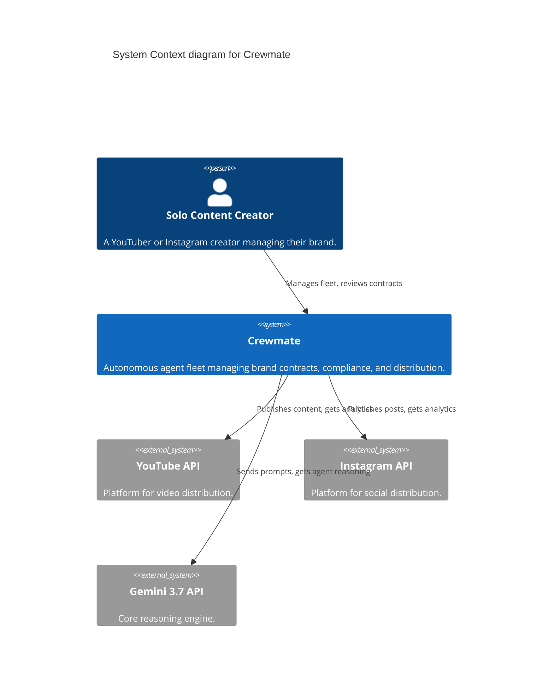
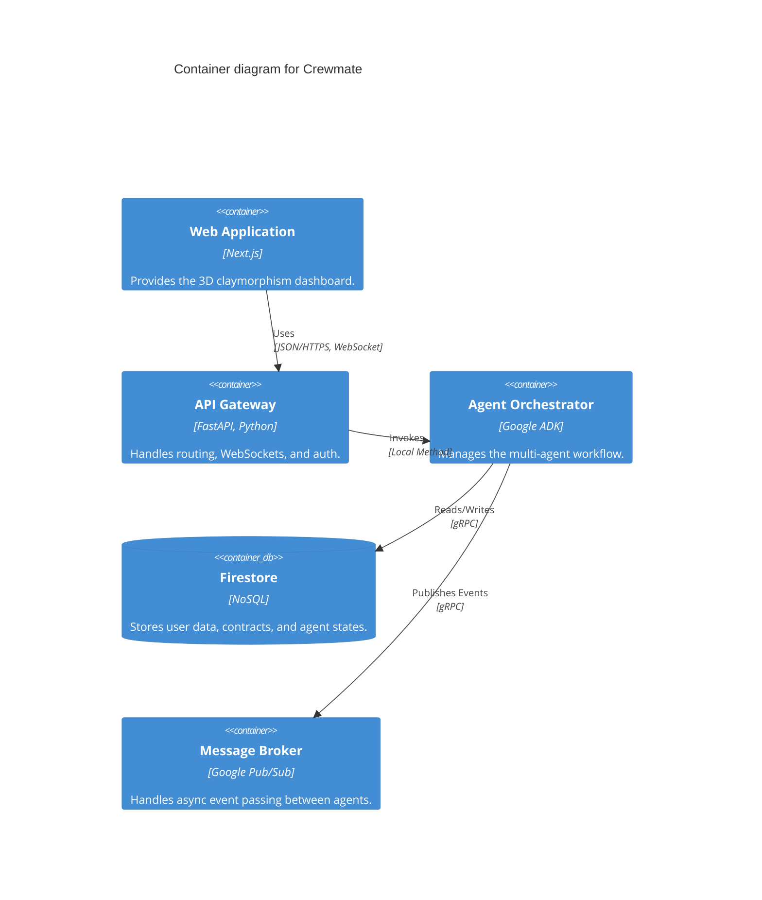
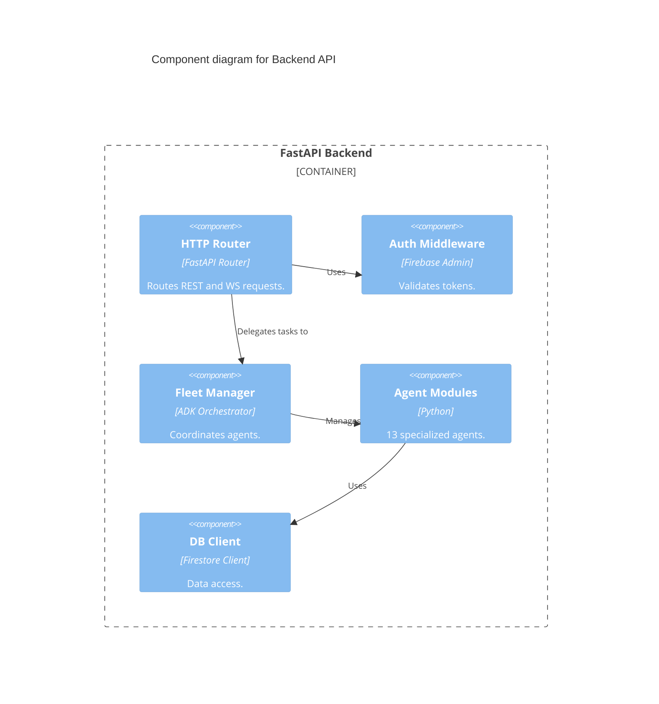

# System Architecture & Design — Crewmate

## 1. Architecture Overview (7-Layer Model)



## 2. Detailed Component Diagram



## 3. C4 Model Diagrams

### 3.1 Context Diagram


### 3.2 Container Diagram


### 3.3 Component Diagram (Backend API)


## 4. Architecture Decision Records (ADRs)

| ADR ID | Decision | Rationale |
|---|---|---|
| **ADR-001** | Hierarchical Supervisor over Peer Swarm | Deterministic routing, lower token costs, predictable state transitions. |
| **ADR-002** | Firebase/Firestore over Cloud SQL | Document-native agent state, real-time listeners out-of-the-box. |
| **ADR-003** | Pub/Sub over direct HTTP for agent events | Provides backpressure, automated retries, and DLQ for failing tasks. |
| **ADR-004** | 3D Claymorphism for UI | Warm, human-designed aesthetic with soft depth. Award-winning visual identity that feels approachable yet professional for non-technical creators. |
| **ADR-005** | Model tiering (Gemini 3.7 vs Gemma) | Gemini 3.7 Flash for deep reasoning, Gemma for fast, cheap classification. |
| **ADR-006** | Circuit breaker per agent | Prevents cascade failures. Max 3 retries, 30s timeout per agent task. |
| **ADR-007** | FastAPI over Flask/Django | Async support is crucial for GenAI, native Pydantic integration. |
| **ADR-008** | WebSocket over polling | Lower latency for real-time agent updates to the creator UI. |

## 5. Security Architecture

### Model Armor Integration
All inputs to agents pass through Model Armor to prevent prompt injection and sanitize PII.
```python
from google.cloud import modelarmor_v1
# Pseudocode implementation
def check_safety(prompt: str) -> bool:
    client = modelarmor_v1.ModelArmorClient()
    response = client.sanitize_user_prompt(
        request={"template_name": "projects/.../templates/crewmate", "text": prompt}
    )
    return response.safe
```

### Agent Identity RBAC
| Agent | Role | Data Access |
|---|---|---|
| Orchestrator | Admin | All |
| Contract Reviewer | ContractReader | Contracts (Read/Write) |
| Audience Analyst | AnalyticsReader | Analytics (Read Only) |
| Distribution Mgr | Publisher | Social Tokens (Read) |
| Trend Radar | Strategist | `content_history`, `trending_data` (Read), `content_briefs` (Write) |
| Hook Architect | Scripter | `content_briefs`, `retention_data` (Read), `scripts` (Write) |
| Clipping Director | Editor | `transcripts`, `video_metadata` (Read), `clips` (Write) |
| Community Guardian | Moderator | `comments` (Read), `moderation_actions`, `sentiment_reports` (Write) |

## 6. Error Handling & Resilience
- **Circuit Breaker:** If Gemini API fails 3 times, circuit opens, fallback to cached state.
- **DLQ:** Failed Pub/Sub messages routed to a Dead Letter Queue for manual review.
- **Graceful Degradation:** If optional agents (e.g., Audience Analyst, Agents 10-13) fail, core flow (Contract Review) continues.

## 7. Cross-Cutting Concerns
- **Logging/Monitoring:** Handled via OpenTelemetry exported to Google Cloud Trace.
- **Secrets:** Google Secret Manager for all API keys.
- **Config:** Environment-based overrides via Pydantic BaseSettings.

## 8. GEAP Component Implementation Map
- **Goal:** Managed by Orchestrator based on creator input.
- **Environment:** Monitored by Threat Sentinel and Brand Safety.
- **Action:** Executed by Distribution Manager and tools.
- **Perception:** Real-time listeners on Firestore and Webhooks.
