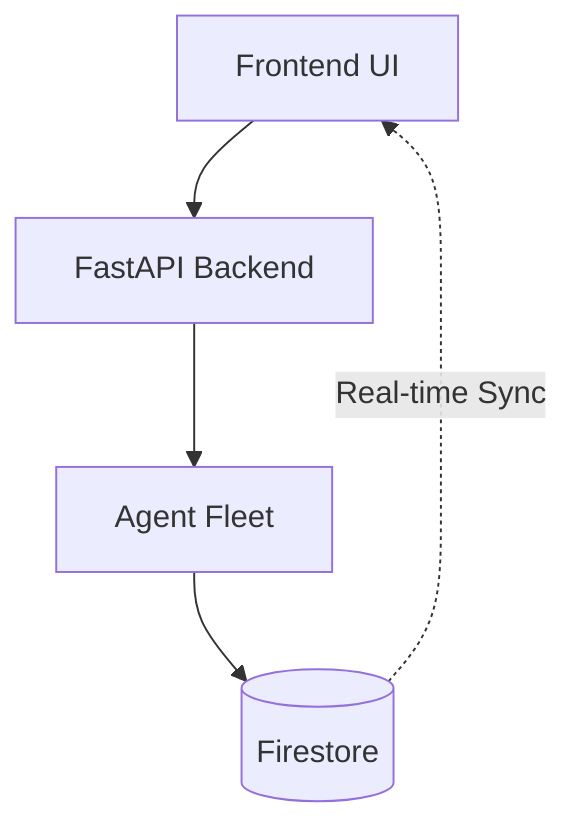

# Database Design & Schemas — Crewmate

## 1. Database Choice Rationale
We use **Firebase/Firestore** for Crewmate for the following reasons:
- **Document-Native Agent State**: Agents produce flexible, nested JSON data (like reasoning chains and schemas) which map perfectly to Firestore documents.
- **Real-time Listeners**: Frontend can listen to agent state changes in real-time without heavy polling.
- **Serverless Scaling**: Handles spiky hackathon workloads seamlessly.
- **Firebase MCP Integration**: Antigravity/Claude can use MCP to easily manage Firebase projects and rules.

## 2. Collection Schemas

### `agents`
Registry of all fleet agents.
- `id` (String): e.g., "orchestrator"
- `name` (String)
- `version` (String)
- `status` (String): "idle", "running", "error"
- `capabilities` (Array<String>)
- `health` (String)
- `metrics` (Map): e.g., `{"tasks_completed": 42}`

### `contracts`
Uploaded contracts and analysis.
- `id` (String)
- `user_id` (String)
- `title` (String)
- `file_url` (String)
- `status` (String): "pending", "analyzing", "completed"
- `analysis` (Map): Extracted clauses, risks.
- `created_at` (Timestamp)

### `compliance_results`
Compliance scan results per platform.
- `id` (String)
- `content_id` (String)
- `platform` (String): "youtube", "instagram"
- `status` (String): "safe", "flagged"
- `flags` (Array<Map>)
- `scanned_at` (Timestamp)

### `memory`
Memory Bank context.
- `id` (String)
- `user_id` (String)
- `type` (String): "brand_history", "preferences"
- `data` (Map)
- `updated_at` (Timestamp)

### `traces`
Agent observability.
- `id` (String)
- `agent_id` (String)
- `trace_id` (String)
- `reasoning_steps` (Array<String>)
- `tool_calls` (Array<Map>)
- `latency_ms` (Number)
- `created_at` (Timestamp)

### `reports`
Generated reports.
- `id` (String)
- `user_id` (String)
- `type` (String)
- `content` (String)
- `video_url` (String, Optional)
- `created_at` (Timestamp)

### `calendar`
Content schedule.
- `id` (String)
- `content_id` (String)
- `platform` (String)
- `publish_time` (Timestamp)
- `status` (String): "scheduled", "published"

### `revenue`
Revenue analytics.
- `id` (String)
- `user_id` (String)
- `source` (String)
- `amount` (Number)
- `currency` (String)
- `date` (Timestamp)

### `content_briefs`
- `id` (String)
- `creator_id` (String)
- `topic` (String)
- `velocity_score` (Number)
- `format` (String)
- `platform` (String)
- `titles` (Array<String>)
- `viral_angle` (String)
- `competitor_saturation` (Number)
- `status` (String)
- `created_at` (Timestamp)

### `scripts`
- `id` (String)
- `creator_id` (String)
- `brief_id` (String)
- `hook_variants` (Array<String>)
- `full_script` (String)
- `beats` (Array<String>)
- `thumbnail_concepts` (Array<String>)
- `retention_score` (Number)
- `created_at` (Timestamp)

### `clips`
- `id` (String)
- `creator_id` (String)
- `video_id` (String)
- `start_ts` (Number)
- `end_ts` (Number)
- `summary` (String)
- `platform_packages` (Map)
- `performance_score` (Number)
- `status` (String)
- `created_at` (Timestamp)

### `comment_analysis`
- `id` (String)
- `creator_id` (String)
- `content_id` (String)
- `platform` (String)
- `sentiment_distribution` (Map)
- `clusters` (Array<String>)
- `toxic_flagged` (Array<String>)
- `suggested_replies` (Array<String>)
- `content_signals` (Array<String>)
- `created_at` (Timestamp)

## 3. Firestore Security Rules
```javascript
rules_version = '2';
service cloud.firestore {
  match /databases/{database}/documents {
    match /{document=**} {
      allow read, write: if request.auth != null;
    }
    match /agents/{agentId} {
      allow read: if request.auth != null;
      allow write: if request.auth.token.role == 'admin';
    }
  }
}
```

## 4. Data Flow Diagram


## 5. Indexing Strategy
- Composite Index: `contracts` on `user_id` ASC, `created_at` DESC
- Composite Index: `calendar` on `user_id` ASC, `publish_time` ASC

## 6. Data Lifecycle
- **Traces**: TTL of 30 days to save space.
- **Contracts**: Retained indefinitely unless deleted by user.
- **Reports**: Archived after 1 year.
