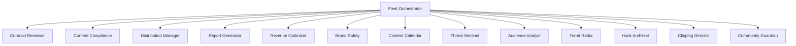
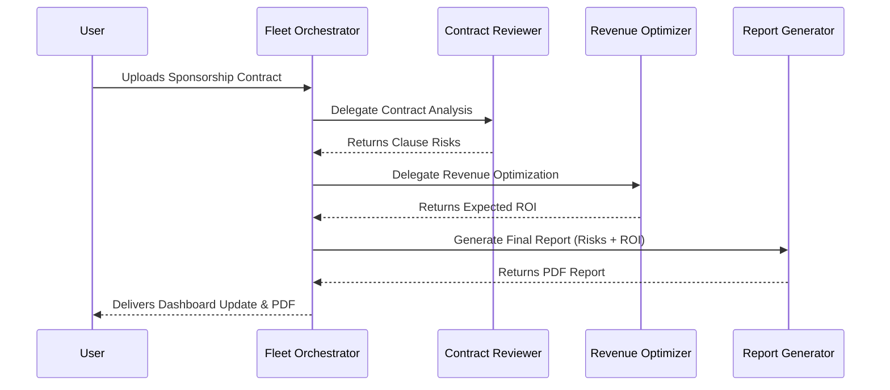

# Agent Workflow Overview — Crewmate

## 1. Fleet Topology

## 2. Communication Patterns
- **Hub and Spoke Model**: All agents communicate exclusively through the Fleet Orchestrator. 
- **No Peer-to-Peer**: Agents do not directly invoke each other to prevent circular dependencies and to maintain centralized state management.
- **Message Format**: Pydantic models validate all inputs and outputs between the Orchestrator and specialist agents.

## 3. ADK Integration
- **SequentialAgent**: Used for linear pipelines (e.g., File Upload → OCR → Extraction → Analysis).
- **ParallelAgent**: Used when tasks are independent (e.g., scoring contract risks while simultaneously scanning content for FTC compliance).

## 4. Antigravity SDK Integration
- **Safety Policies**: Every agent utilizes Model Armor to filter PII and toxic content before reasoning.
- **Budget Governance**: Orchestrator enforces token limits and hard cost caps using Antigravity budget hooks.
- **Hooks**: Request/Response hooks inject trace IDs for Cloud Trace observability.

## 5. Agent Lifecycle
1. **Registration**: Agents register with the Orchestrator on startup (via `lookup_agent_registry`).
2. **Discovery**: Orchestrator matches user intents to registered agent capabilities.
3. **Execution**: Orchestrator delegates tasks via Pub/Sub for async processing.
4. **Error Handling**: Worker failures trigger a circuit breaker. Orchestrator retries or returns fallback responses.
5. **Deregistration**: Agents can deregister if they encounter fatal initialization errors.

## 6. Orchestration Patterns
- **Sequential**: Contract upload → analyze contract → generate summary report.
- **Parallel**: Contract analysis + Revenue optimization run simultaneously on the same brand deal info.
- **Conditional**: If Content Compliance finds a copyright strike on audio, it conditionally triggers Lyria to generate alternative music.
- **Growth Pipeline**: Trend Radar discovers topic → Hook Architect writes script → Distribution Manager publishes → Audience Analyst measures
- **Repurposing Pipeline**: Clipping Director extracts clips → Content Compliance scans clips → Distribution Manager schedules across platforms
- **Feedback Loop**: Community Guardian clusters comments → Trend Radar incorporates viewer requests → Content Calendar schedules

## 7. Tool Sharing
- **Shared Tools**: `FirestoreClient`, `CloudStorageClient`, `ModelArmorClient`.
- **Agent-Specific Tools**: `LyriaClient` (Compliance), `VeoClient` (Content), `GeminiVisionClient` (Contract Reviewer), `TrendAnalyzerClient` (Trend Radar), `RetentionAnalyzerClient` (Hook Architect), `TranscriptEnergyClient` (Clipping Director), `SentimentClassifierClient` (Community Guardian) — uses gemma-2-9b.

## 8. Inter-Agent Data Flow

## 9. Error Propagation
- **Worker Error**: Agent fails task, throws `AgentExecutionError`.
- **Orchestrator Catch**: Orchestrator catches error, logs to Cloud Trace, attempts up to 3 retries.
- **Circuit Breaker**: If max retries hit, Circuit Breaker opens. Orchestrator sends a standardized `PartialSuccess` or `Failed` response to User, preventing fleet halt.

## 10. Agent Registry Pattern
- Centralized dictionary in the Orchestrator memory loaded from a Firestore configuration at startup.
- Defines Agent ID, capabilities, required input schema, and endpoint/topic.

**Reference Agent Docs:**
- `agents/agent-00-fleet-orchestrator.md`
- `agents/agent-01-contract-reviewer.md`
- `agents/agent-02-content-compliance.md`
- `agents/agent-10-trend-radar.md`
- `agents/agent-11-hook-architect.md`
- `agents/agent-12-clipping-director.md`
- `agents/agent-13-community-guardian.md`
