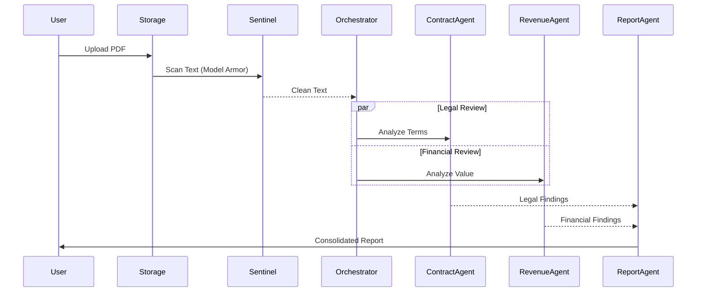
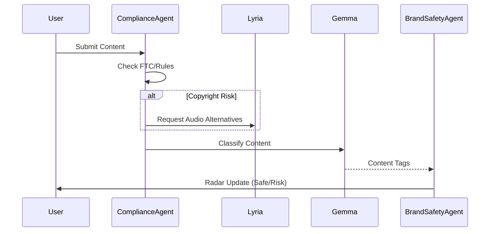
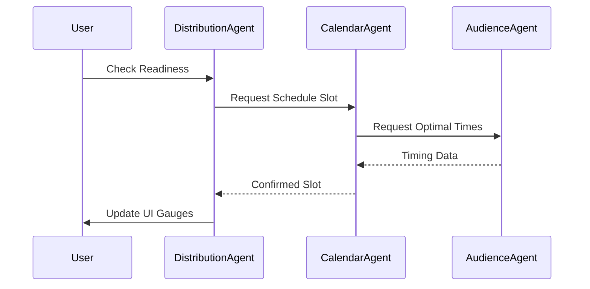
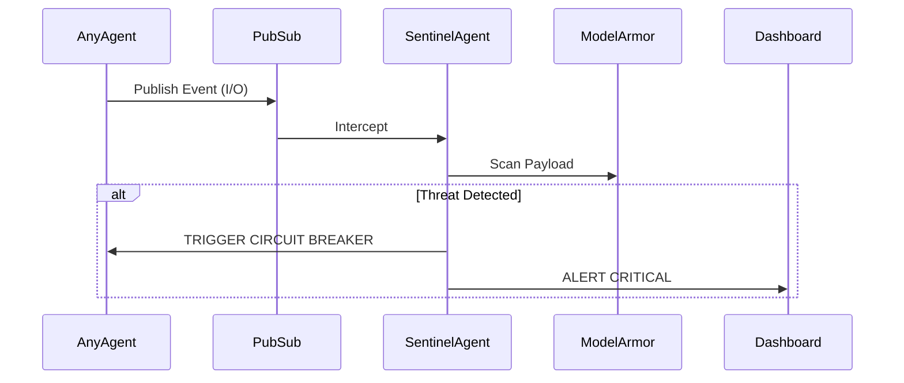
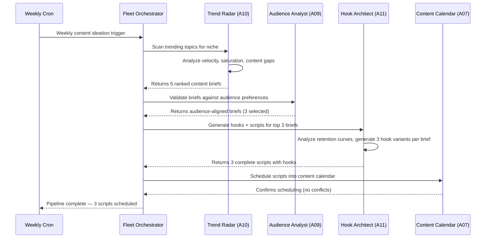
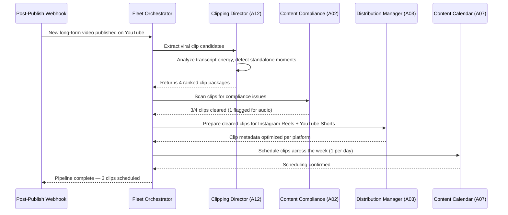
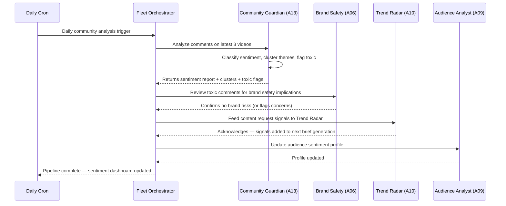

# Automation Workflows — Crewmate

This document details the 6 core end-to-end autonomous pipelines that demonstrate the true "agentic" capabilities of Crewmate. These workflows utilize Pub/Sub for asynchronous event-driven execution, state management in Firestore, and Model Armor for security.

## 1. Contract Review Pipeline
**Trigger**: User uploads a brand deal PDF via the React 19 frontend.
**Duration**: ~15-20 seconds.

### Flow
1. PDF uploaded to Cloud Storage; triggers Cloud Function.
2. OCR extracts text. Text sent to **Threat Sentinel** (Model Armor scan).
3. **Fleet Orchestrator** receives clean text, spins up parallel tasks.
4. **Contract Agent** analyzes legal terms, deliverables, and red flags.
5. **Revenue Agent** analyzes compensation against benchmark data.
6. **Compliance Agent** checks FTC guidelines and brand safety alignment.
7. **Report Agent** aggregates findings into a structured summary.
8. Dashboard updates via Firestore listener.

### Mermaid Diagram

## 2. Content Compliance Scan
**Trigger**: Creator submits content metadata/script/video URL before publishing.
**Duration**: ~10 seconds.

### Flow
1. **Compliance Agent** reviews for FTC disclosure, platform rules (YouTube/Instagram), and copyright material.
2. If copyright flag detected: Calls **Lyria** (bonus model) API to suggest royalty-free music alternatives.
3. Content passed to **Gemma** (bonus model) for fast classification (e.g., PG-13, Educational).
4. **Brand Safety Agent** cross-references content against active brand deal requirements.
5. Updates the "Radar Screen" UI on the dashboard.

### Mermaid Diagram

## 3. Multi-Platform Distribution
**Trigger**: Creator clicks "Check Readiness" for a completed asset.
**Duration**: ~5 seconds.

### Flow
1. **Distribution Agent** verifies asset meets technical specs for YouTube (16:9, 4K) and Instagram (9:16, 1080p).
2. **Calendar Agent** checks for scheduling conflicts (24h YT gap, 4h IG gap).
3. **Audience Agent** calculates the optimal posting time based on demographics.
4. "Readiness Gauges" on the frontend update dynamically.

### Mermaid Diagram

## 4. Revenue Analysis
**Trigger**: Scheduled weekly OR Voice command ("How is my revenue tracking?").
**Duration**: ~8 seconds.

### Flow
1. **Revenue Agent** queries historical data from Memory Bank (Firestore).
2. Benchmarks current performance vs. industry averages.
3. Generates negotiation suggestions for upcoming renewals.
4. Outputs data to **Report Agent** for rendering.

## 5. Threat Monitoring (Background)
**Trigger**: Continuous background process listening to all agent Pub/Sub topics.
**Duration**: Real-time.

### Flow
1. **Sentinel Agent** intercepts an agent's Input/Output.
2. Calls `model_armor_scan()`.
3. If prompt injection or PII leak detected:
4. Triggers Circuit Breaker (State transitions to OPEN).
5. Alerts dashboard immediately.

### Mermaid Diagram

## 6. Executive Summary Generation
**Trigger**: Scheduled (End of Month) OR manual request.
**Duration**: ~45 seconds (due to video generation).

### Flow
1. **Report Agent** aggregates metrics from Audience, Revenue, and Content Calendar agents.
2. Generates a comprehensive PDF report.
3. Sends key bullet points to **Veo** (bonus model) to generate a short, personalized video summary ("Hello Creator, here is your month in review...").
4. Saves to Memory Bank and notifies the user.

---

## Pipeline 7: Content Ideation & Scripting Pipeline

- **Trigger**: Weekly cron (Monday 9:00 AM)
- **Duration**: ~45 seconds
- **Error Handling**: If Trend Radar fails, Audience Analyst suggests topics from historical data. If Hook Architect fails, briefs are delivered without scripts.

---

## Pipeline 8: Smart Repurposing Pipeline

- **Trigger**: Automatic — fires when a new YouTube video is published
- **Duration**: ~30 seconds
- **Error Handling**: If Clipping Director fails, Distribution Manager still publishes the original video. Flagged clips are held for manual review.

---

## Pipeline 9: Community Feedback Loop

- **Trigger**: Daily cron (8:00 PM)
- **Duration**: ~25 seconds
- **Error Handling**: If Community Guardian fails, dashboard shows cached previous analysis. Toxic content moderation is always processed first (highest priority sub-task).
