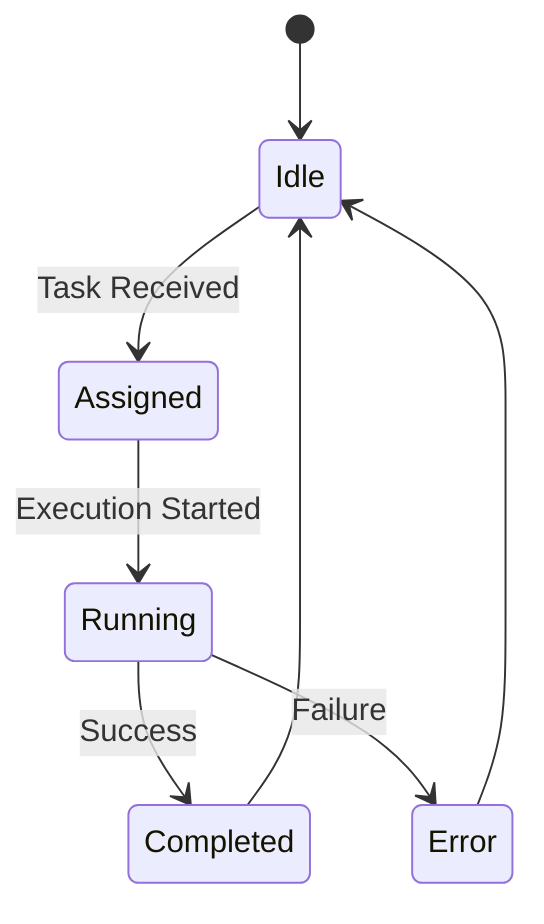
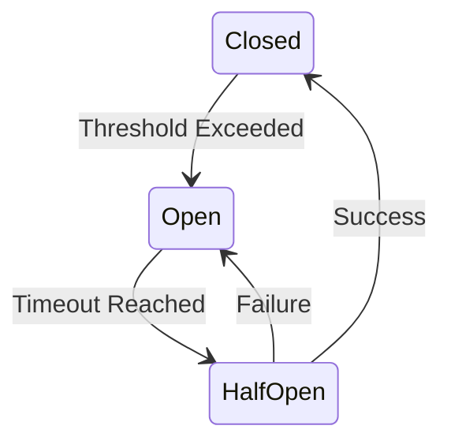
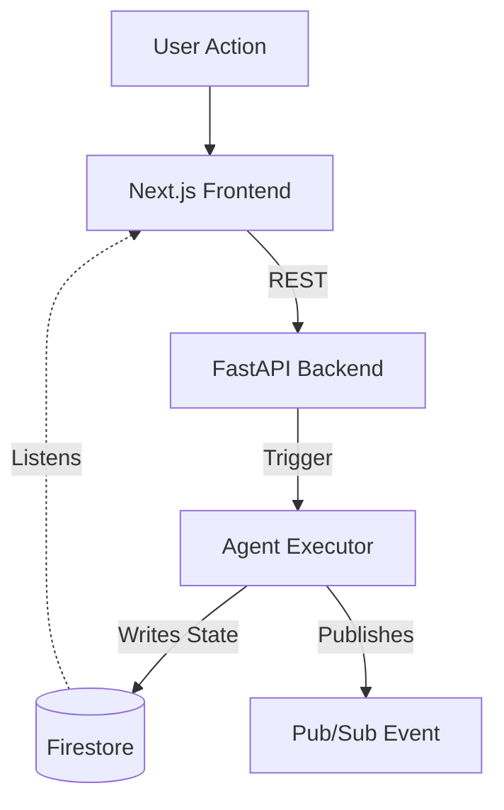

# State Management — Crewmate

## 1. Frontend State
- **React Context**: Used for global user authentication, theme preferences, and WebSocket connection status.
- **Hooks**: Custom hooks (`useFleetWebSocket`) sync real-time agent status into local component state.
- **Local State**: Used for UI-specific transient state (e.g., modals, form inputs).

## 2. Backend State
- **FastAPI**: Stateless REST endpoints. State is derived entirely from Firestore and Firebase Auth tokens.
- **Agent Session**: Temporary state during execution is held in memory, then flushed to Firestore as a trace or status update.

## 3. Agent State Machine

## 4. Firestore State Patterns
- **Optimistic Locking**: Agents use transaction blocks in Firestore to acquire a lock on a task to prevent duplicate processing.
- **Document-Based State**: Each agent’s state is stored in the `agents` collection and updated via PATCH operations.

## 5. WebSocket State Sync
- Fast updates (e.g., streaming LLM output, rapid agent state transitions) bypass Firestore and go directly via WebSockets to the frontend.
- Fallback to Firestore polling is available if WebSocket disconnects.

## 6. Memory Bank State
- **Cross-Session**: Agents query the `memory` collection to recall previous brand deals or user preferences.
- **Updates**: Memory is updated asynchronously after task completion (e.g., adding a new brand to history).

## 7. Circuit Breaker State

## 8. Pub/Sub Event Flow
- Asynchronous tasks (like Veo video generation) trigger a Pub/Sub message.
- A Cloud Run worker picks up the message, updates Firestore state to `processing`, and publishes a completion event when done.

## 9. State Diagram

