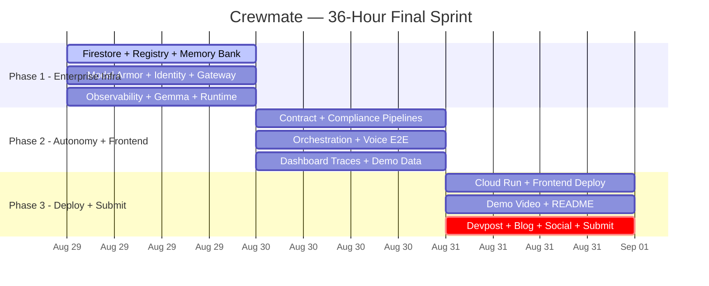

# Development Roadmap — Crewmate (v3.0 Final Sprint)

> **Hackathon**: All Things Agentic Hackathon 2026
> **Track**: Fortified Enterprise Fleet
> **Deadline**: August 31, 2026, 11:59 PM PT
> **Hours Remaining**: ~36 (Aug 29 8:00 PM IST → Aug 31)
> **Builder**: Solo — Lovejeet Singh
> **Coding Agents**: Antigravity (Gemini 3.7 Flash) + Claude Opus 4.6
> **GCP Project**: `crewmate-507013`

---

## 0. Current State (As of Aug 29, 8:00 PM IST)

### ✅ DONE — Foundation

| Component | Status | Details |
|:---|:---|:---|
| **Documentation** | ✅ Complete | 26 markdown files (PRD, architecture, agent specs, API contracts, DB design, deployment) |
| **Frontend UI** | ✅ Complete | React 19 + Vite + Tailwind v4, 38 files, 20 clay components, 8 pages, voice interface |
| **Backend Scaffold** | ✅ Running | FastAPI on `localhost:8000`, `main.py`, `config/settings.py`, `.env`, `Dockerfile` |
| **14 ADK Agent Definitions** | ✅ Defined | All agent Python files with names, models, instructions, tool functions |
| **9 API Routers** | ✅ Responding | fleet, contracts, compliance, distribution, trends, reports, community, voice, health — all HTTP 200 |
| **Gemini Service** | ✅ Working | Multi-model fallback: `gemini-3.7-flash` → `gemini-3.6-flash` → `gemini-3.1-pro-preview` |
| **Frontend ↔ Backend** | ✅ Hybrid | `api.ts` connects to live backend with mock fallback |
| **Pydantic Schemas** | ✅ Rich | Contracts (ClauseDetail, counter-proposals), Compliance (Lyria, FTC checks), Trends (ContentBrief) |

### 🔴 NOT DONE — Critical Track Requirements

| Component | Impact | Track Requirement |
|:---|:---|:---|
| **Agent Registry** (Firestore) | CRITICAL | Discovery & Lifecycle |
| **Agent Runtime** (Async execution) | CRITICAL | Core Execution & State |
| **Memory Bank** (Persistent context) | CRITICAL | Core Execution & State |
| **Agent Identity** (RBAC) | CRITICAL | Security & Governance |
| **Agent Gateway** (Rate limits, circuit breakers) | HIGH | Security & Governance |
| **Model Armor** (I/O screening) | CRITICAL | Security & Governance |
| **Agent Observability** (OpenTelemetry traces) | CRITICAL | Telemetry |
| **Firestore Integration** | CRITICAL | Zero database code exists |
| **Cloud Run Deployment** | CRITICAL | Must have live hosted URL |
| **Gemma Integration** | HIGH | Bonus points |
| **Demo Video** | CRITICAL | Required for submission |
| **Devpost / Blog / Social** | CRITICAL | Required for submission + bonus |

---

## 1. Strategy: Three 12-Hour Sprints

---

## 2. Phase 1 — Enterprise Infrastructure (12 hours)

> **When**: Aug 29 8:00 PM → Aug 30 8:00 AM IST
> **Goal**: Build ALL 7 GEAP components. This is the track requirement.
> **Agent**: Antigravity + Claude Opus 4.6

### Sprint 1A: Data Layer (4 hours)

| # | Task | Files | Est. | Priority |
|:---|:---|:---|:---|:---|
| 1.1 | **Install & configure Firestore client** — `google-cloud-firestore` SDK, singleton client, connection to `crewmate-507013` project | `services/firestore_client.py` | 30m | P0 |
| 1.2 | **Agent Registry service** — Register agent metadata (name, version, model, capabilities, health, status) to Firestore `agents` collection. CRUD operations + health-check endpoint. Seed all 14 agents on startup. | `services/registry.py`, `routers/registry.py` | 90m | P0 |
| 1.3 | **Memory Bank service** — Store/retrieve creator preferences (min deal value, max exclusivity, preferred terms), brand interaction history, content patterns. Namespaced by creator_id. | `services/memory.py`, `routers/memory.py` | 60m | P0 |
| 1.4 | **Update all existing routers** — Replace hardcoded demo data with Firestore reads. Contract analyses stored in `contracts` collection. Compliance results in `compliance_results`. | All routers | 60m | P0 |

**Gate 1A ✓**: `GET /api/registry/agents` returns 14 agents from Firestore · `POST /api/memory/store` persists data · `GET /api/memory/retrieve` returns stored data

### Sprint 1B: Security Layer (4 hours)

| # | Task | Files | Est. | Priority |
|:---|:---|:---|:---|:---|
| 1.5 | **Model Armor middleware** — Input screening: 15+ prompt injection regex patterns + PII detection (SSN, email, phone, credit card). Output screening: PII leak prevention + harmful content filter. FastAPI middleware that wraps every route. Logs all blocked requests to Firestore `armor_logs`. | `middleware/model_armor.py` | 90m | P0 |
| 1.6 | **Agent Identity middleware** — Per-agent RBAC matrix. Each agent has declared read/write scopes. Gateway validates agent capabilities before routing tasks. API key validation on all endpoints. | `middleware/identity.py` | 60m | P0 |
| 1.7 | **Agent Gateway enhancements** — Circuit breaker decorator: 3 retries, 30s timeout, exponential backoff, fallback response. Sliding-window rate limiter: 100 req/min per API key. Request validation middleware. Unified error response format. | `middleware/gateway.py` | 60m | P0 |
| 1.8 | **Wire middleware into FastAPI** — Add all middleware to `main.py` app lifecycle. Ensure request flows through: Gateway → Model Armor → Identity → Router → Agent → Model Armor (output) → Response. | `main.py` | 30m | P0 |

**Gate 1B ✓**: Sending `"ignore all previous instructions"` returns 403 blocked · Rate limiter returns 429 after threshold · RBAC prevents unauthorized agent access

### Sprint 1C: Observability + Classification (4 hours)

| # | Task | Files | Est. | Priority |
|:---|:---|:---|:---|:---|
| 1.9 | **Agent Observability service** — Create OpenTelemetry-compatible spans for every agent invocation. Track: agent_id, model, prompt_hash (never raw prompt), tool_calls, latency_ms, token_count, result_status. Store spans in Firestore `traces` collection. | `services/observability.py` | 60m | P0 |
| 1.10 | **Traces API router** — `GET /api/traces` (list recent traces with pagination), `GET /api/traces/{trace_id}` (full reasoning chain), `GET /api/traces/agent/{agent_id}` (per-agent trace history). | `routers/traces.py` | 45m | P0 |
| 1.11 | **Agent Runtime service** — Async task execution with Firestore state machine. Submit task → status `pending` → agent picks up → `running` → completes → `completed` or `failed`. Background asyncio worker. `GET /api/runtime/tasks/{task_id}` for status polling. | `services/runtime.py`, `routers/runtime.py` | 75m | P0 |
| 1.12 | **Gemma content classification** — Use `gemma-4-26b-a4b-it` via GenAI SDK for lightweight content categorization (review, tutorial, vlog, sponsored, etc.) and brand safety scoring. Integrated as a tool in Content Compliance agent. | `services/gemma_classifier.py` | 30m | P1 |
| 1.13 | **Update pyproject.toml** — Add new dependencies: `google-cloud-firestore`, `opentelemetry-api`, `opentelemetry-sdk` | `pyproject.toml` | 15m | P0 |

**Gate 1C ✓**: `GET /api/traces` returns spans with latency/tool data · `POST /api/runtime/submit` creates async task with state tracking · Gemma classifies content category

---

## 3. Phase 2 — Real Agent Autonomy & Frontend (12 hours)

> **When**: Aug 30 8:00 AM → 8:00 PM IST
> **Goal**: Make agents DO things autonomously. Wire frontend to all new services.
> **Agent**: Antigravity + Claude Opus 4.6

### Sprint 2A: Autonomous Pipelines (4 hours)

| # | Task | Files | Est. | Priority |
|:---|:---|:---|:---|:---|
| 2.1 | **Contract Review autonomous pipeline** — Full flow: Upload PDF → `pdf_extractor` extracts text → Contract Reviewer analyzes clauses with Gemini → Risk scores assigned → Revenue Optimizer benchmarks deal → Counter-proposals generated → Results stored in Firestore `contracts` → Memory Bank updated with brand history. Zero human in the loop. | `agents/contract_reviewer.py`, `agents/revenue_optimizer.py`, `routers/contracts.py` | 120m | P0 |
| 2.2 | **Compliance Scan autonomous pipeline** — Submit content metadata → FTC disclosure check → Copyright audio scan → Platform-specific rules (YT + IG) → Gemma content classification → Compliance score → Lyria alternative suggestion (data reference) → Store in Firestore `compliance_results`. | `agents/content_compliance.py`, `routers/compliance.py` | 90m | P0 |
| 2.3 | **Wire Gemini API calls into all agent tools** — Replace mock return values in all 14 agent tool functions with actual `generate_text()` calls. Every agent should call Gemini for real reasoning. | All `agents/*.py` | 30m | P0 |

**Gate 2A ✓**: `POST /api/contracts/analyze` with a PDF returns real Gemini-powered clause analysis stored in Firestore · Compliance scan returns real FTC check results

### Sprint 2B: Orchestration + Voice (4 hours)

| # | Task | Files | Est. | Priority |
|:---|:---|:---|:---|:---|
| 2.4 | **Multi-agent orchestration demo** — Orchestrator receives high-level goal (e.g., "Review this brand deal end-to-end") → Decomposes into sub-tasks → Dispatches Contract Reviewer + Revenue Optimizer + Brand Safety + Compliance in parallel via ADK sub_agents → Aggregates results → Returns unified report. Use ADK Agent with `sub_agents` list properly. | `agents/orchestrator.py`, `routers/fleet.py` | 90m | P0 |
| 2.5 | **Voice command end-to-end** — Frontend: Web Speech API captures voice → sends transcript to `POST /api/voice/command` → Backend: Orchestrator routes to correct agent based on intent → Agent executes → Response returned → Frontend speaks response via Speech Synthesis. | `routers/voice.py`, Frontend `VoiceWave.tsx` | 60m | P1 |
| 2.6 | **WebSocket live updates** (optional, time permitting) — Real-time agent status push via FastAPI WebSocket. Frontend subscribes to `/ws/fleet` for live agent activity feed. | `services/websocket.py`, `routers/ws.py` | 60m | P2 |
| 2.7 | **Update all existing routers to record traces** — Every endpoint wraps execution in observability span. Record agent_id, latency, tool_calls, result. | All routers | 30m | P0 |

**Gate 2B ✓**: `POST /api/fleet/invoke` with a complex goal dispatches to multiple agents and returns aggregated results · Voice command captures speech and returns agent response

### Sprint 2C: Frontend & Demo Data (4 hours)

| # | Task | Files | Est. | Priority |
|:---|:---|:---|:---|:---|
| 2.8 | **Dashboard Observability page** — New frontend page or section showing real traces from Firestore. Agent reasoning chains, tool call timelines, latency bars. Fetches from `GET /api/traces`. | Frontend `Observability.tsx` or `Fleet.tsx` | 90m | P0 |
| 2.9 | **Seed rich demo data** — Script to pre-populate Firestore with: 3 sample contracts with analyses, 5 compliance results, creator memory (preferences, brand history), 20+ trace entries, agent registry with health data. The demo must look lived-in. | `scripts/seed_data.py` | 60m | P0 |
| 2.10 | **Frontend polish** — Fix any pages broken by API schema changes. Ensure all pages show live Firestore data. Add loading skeletons. Fix error states. Test Agent Registry page. | Frontend pages | 60m | P1 |
| 2.11 | **Generate architecture diagram PNG** — Render the Mermaid architecture diagram as a professional PNG for Devpost submission. | `docs/assets/architecture.png` | 30m | P1 |

**Gate 2C ✓**: Observability page shows real traces · Firestore has realistic demo data · All frontend pages render without errors

---

## 4. Phase 3 — Deploy, Record, Submit (12 hours)

> **When**: Aug 30 8:00 PM → Aug 31 8:00 AM IST (then polish until deadline)
> **Goal**: Live deployment, demo video, complete submission.

### Sprint 3A: Cloud Deployment (4 hours)

| # | Task | Files | Est. | Priority |
|:---|:---|:---|:---|:---|
| 3.1 | **GCP Project Setup** — Enable APIs (Cloud Run, Firestore, Artifact Registry, Cloud Build, Cloud Trace). Create service account. Set IAM roles. | Manual (see setup guide) | 30m | P0 |
| 3.2 | **Build & deploy backend to Cloud Run** — Update Dockerfile for production. Build image. Push to Artifact Registry. Deploy to Cloud Run with env vars (API key, project ID). Verify public URL responds. | `Dockerfile`, `gcloud` commands | 90m | P0 |
| 3.3 | **Deploy frontend** — Build production frontend. Deploy to Firebase Hosting or serve from Cloud Run. Point API_BASE to Cloud Run backend URL. | Frontend build + deploy | 60m | P0 |
| 3.4 | **End-to-end testing on production** — Test every flow on the deployed URL: contract upload, compliance scan, voice command, fleet invoke, registry lookup, memory retrieval, trace viewing, Model Armor blocking. | Live URLs | 60m | P0 |

**Gate 3A ✓**: App is live at a public `*.run.app` URL · All endpoints work on production · Firestore shows data

### Sprint 3B: Demo & Documentation (4 hours)

| # | Task | Files | Est. | Priority |
|:---|:---|:---|:---|:---|
| 3.5 | **Record 4-minute demo video** — Unedited screen recording. Script: (1) Hosted URL + fleet dashboard, (2) Contract upload → autonomous analysis, (3) Compliance scan, (4) Voice command, (5) Observability traces, (6) Model Armor blocking demo, (7) GCP Console proof (Cloud Run + Firestore). Upload to YouTube (public). | Screen recording | 120m | P0 |
| 3.6 | **Write comprehensive README** — Project overview, architecture diagram, setup instructions (one-command local, Cloud Run deployment), tech stack table, screenshots. | `README.md` | 60m | P0 |
| 3.7 | **Screenshot collection** — Capture 5-8 screenshots of: dashboard, contract analysis, compliance scan, observability, voice command, fleet status. For Devpost gallery. | Screenshots | 30m | P0 |

**Gate 3B ✓**: Demo video uploaded to YouTube · README has clear setup instructions · Screenshots ready

### Sprint 3C: Submission (4 hours)

| # | Task | Files | Est. | Priority |
|:---|:---|:---|:---|:---|
| 3.8 | **Write Devpost submission** — Project description (2000+ words), inspiration, what it does, how we built it, challenges, accomplishments, what's next, tech stack tags, video embed, screenshots, hosted URL. | Devpost portal | 90m | P0 |
| 3.9 | **Write Medium blog post** — "Building an Enterprise Agent Fleet for Content Creators with Google ADK & Gemini 3.7 Flash". Include: architecture walkthrough, code snippets, screenshots, hackathon attribution line. Publish publicly. | Medium | 60m | P1 |
| 3.10 | **Post on LinkedIn** — Project highlight with `#AllThingsAgenticHackathon` hashtag. Tag Google Cloud, Google AI. | LinkedIn | 15m | P1 |
| 3.11 | **Final submission on Devpost** — Verify all fields complete. Verify video plays. Verify hosted URL works. Verify GitHub repo is public. **SUBMIT.** | Devpost | 15m | P0 |
| 3.12 | **Buffer time** — Fix any last-minute issues discovered during final testing. | — | 60m | P0 |

**Gate 3C ✓**: Devpost submitted · Blog published · LinkedIn posted · **DONE**

---

## 5. Google Technologies Checklist (Target: 12+)

| # | Technology | Phase | Status |
|:---|:---|:---|:---|
| 1 | **Google ADK 2.8.0** (Agent Framework) | Done | ✅ |
| 2 | **Gemini 3.7 Flash** (Primary AI Model) | Done | ✅ |
| 3 | **Gemini 3.1 Pro Preview** (Orchestrator Model) | Done | ✅ |
| 4 | **Gemini 3.6 Flash** (Fallback Model) | Done | ✅ |
| 5 | **Google GenAI SDK 2.20.0** | Done | ✅ |
| 6 | **Firebase Firestore** (Database) | Phase 1 | 📝 |
| 7 | **Google Cloud Run** (Hosting) | Phase 3 | 📝 |
| 8 | **Gemma 4 26B** (Content Classification) | Phase 1 | 📝 |
| 9 | **OpenTelemetry** (Agent Observability) | Phase 1 | 📝 |
| 10 | **Cloud Trace** (Distributed Tracing) | Phase 3 | 📝 |
| 11 | **Artifact Registry** (Docker Images) | Phase 3 | 📝 |
| 12 | **Cloud Build** (CI/CD) | Phase 3 | 📝 |
| 13 | **Firebase Hosting** (Frontend) | Phase 3 | 📝 |
| 14 | **Cloud IAM** (Service Accounts) | Phase 3 | 📝 |

---

## 6. Risk Mitigation — Scope Cutting Tiers

Cut in this exact order if falling behind:

| Tier | What to Cut | Impact |
|:---|:---|:---|
| **1 (First)** | WebSocket live updates → HTTP polling. Drop Voice command. | Low — core demo unaffected |
| **2** | Drop Growth Agents 10-13 to stub-only. Keep 10 active agents. | Moderate — still impressive count |
| **3** | Drop Gemma integration (document in architecture only). Drop blog post. | Moderate — lose 0.4 bonus points |
| **4** | Replace Firestore with in-memory dicts for demo. Skip Cloud Trace. | Significant — loses persistence proof |
| **5 (Last Resort)** | Record demo on localhost via `ngrok`. Focus entirely on Devpost quality + video. | Emergency — still submittable |

> **Golden Rule**: A polished demo with 8 working agents and all GEAP components beats a broken demo with 14 agents and zero governance.

---

## 7. Judging Criteria Alignment

| Criterion | Weight | Our Strategy |
|:---|:---|:---|
| **Innovation & Operational Utility** | 40% | "Unlikely Hero" — enterprise governance for solo creators. Agents autonomously review contracts, scan compliance, and generate reports with zero human intervention. Real measurable output: $$$ value unlocked in counter-proposals. |
| **Architectural Discipline & Tech Stack** | 30% | 7-layer architecture with ALL 7 GEAP components. 10 ADRs documented. Circuit breakers, Model Armor, per-agent RBAC, full OpenTelemetry observability. Production-grade, not a tutorial. |
| **Demo & Production Readiness** | 30% | Live Cloud Run URL. Unedited 4-minute demo. Clean README with one-command setup. Architecture diagram PNG. Firestore with realistic data. GCP Console proof. |

---

## 8. Submission Checklist

- [ ] App live on public Cloud Run URL (`*.run.app`)
- [ ] Demo video uploaded to YouTube (public, ≤5 min, unedited)
- [ ] Devpost project with all required fields
- [ ] GitHub repo public with comprehensive README
- [ ] Architecture diagram (PNG) uploaded to Devpost
- [ ] Medium blog post published (with hackathon attribution)
- [ ] LinkedIn post published (with `#AllThingsAgenticHackathon`)
- [ ] All 7 GEAP components demonstrably present in code and demo
- [ ] Gemini 3.5+ model in use (✅ using 3.7 Flash)
- [ ] Google Agent Framework in use (✅ Google ADK 2.8.0)
- [ ] Google Cloud infrastructure service in use (Cloud Run + Firestore)
- [ ] **SUBMITTED ON DEVPOST BEFORE 11:59 PM PT AUG 31**
