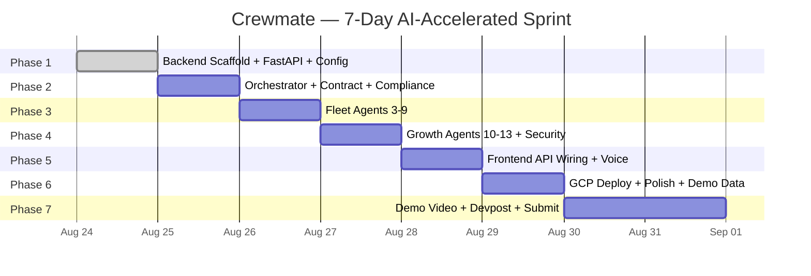

# Development Roadmap — Crewmate (v2.0)

> **Hackathon**: All Things Agentic Hackathon 2026
> **Deadline**: August 31, 2026, 11:59 PM PT
> **Days Remaining**: 7 (Aug 24 → Aug 31)
> **Builder**: Solo — AI-Assisted Development

---

## 0. Current Project Status (As of Aug 24)

### ✅ What's Built

| Component | Status | Details |
|:---|:---|:---|
| **Documentation** | ✅ Complete | 12 spec docs + 14 agent specs (26 markdown files) |
| **Frontend Shell** | ✅ Complete | Vite + React 19 + Tailwind v4 + Framer Motion |
| **38 Frontend Files** | ✅ Complete | 20 clay components, 4 layout components, 8 pages, 3 lib modules |
| **3D Claymorphism Design** | ✅ Complete | Full clay shadow system, CSS custom properties, light theme |
| **Landing Page** | ✅ Complete | 12 interactive sections, ROI calculator, agent simulator, FAQ |
| **Dashboard Pages** | ✅ Complete | Command Center, Contracts, Compliance, Distribution, Fleet, Reports |

### ❌ What's NOT Built

| Component | Status | Scope |
|:---|:---|:---|
| **Backend (Python)** | ❌ Not Started | 0 Python files. No `backend/` directory. |
| **Google ADK Agents** | ❌ Not Started | 0 of 14 agents implemented |
| **FastAPI Gateway** | ❌ Not Started | No API server |
| **Firebase/Firestore** | ❌ Not Started | No database setup |
| **Model Armor** | ❌ Not Started | No security middleware |
| **Frontend ↔ Backend Wiring** | ❌ Not Started | All pages use hardcoded mock data |
| **GCP Deployment** | ❌ Not Started | No Cloud Run, no Docker |
| **Demo Video** | ❌ Not Started | No recording |
| **Devpost Submission** | ❌ Not Started | No write-up posted |

---

## 1. AI Coding Agent Strategy

| Agent | LLM | Strengths | Assigned Work |
|:---|:---|:---|:---|
| **Antigravity (AGY)** | Gemini 3.7 Flash | Parallel subagents, multi-file scaffolds, codebase-wide refactors | Backend scaffold, frontend API wiring, deployment |
| **Cline** | OX Alpha | Fast single-file generation, iterative debugging | Individual agent implementations, tool functions, API routes |
| **Cline** | Claude Opus 4.6 | Complex reasoning, architecture decisions, long context | Orchestrator logic, security layer, integration, documentation |

### Assignment Rules
1. **Scaffold & Parallel Creation** → Antigravity (spawns 10+ subagents)
2. **Individual Agent Python Files** → Cline + OX Alpha (fast, one file at a time)
3. **Complex Integration** → Cline + Claude Opus 4.6 (reasoning-heavy)
4. **Frontend Refactors** → Antigravity (multi-file across all pages)
5. **Documentation & Devpost** → Cline + Claude Opus 4.6 (long-form writing)

---

## 2. Phase Overview

---

## 3. Phase-by-Phase Breakdown

---

### Phase 1 — Backend Scaffold & Infrastructure
**Date**: Aug 24 · **Agent**: Antigravity (parallel subagents) · **Hours**: 6-8

Create the entire backend directory structure, FastAPI app, config, and empty agent stubs.

| # | Task | File(s) |
|:---|:---|:---|
| 1.1 | Create `backend/` directory tree | All dirs |
| 1.2 | `pyproject.toml` with all deps | `backend/pyproject.toml` |
| 1.3 | FastAPI main app with CORS, lifespan | `backend/main.py` |
| 1.4 | Pydantic settings (`.env` loading) | `backend/config/settings.py` |
| 1.5 | Firestore client singleton | `backend/services/firestore.py` |
| 1.6 | Model Armor service stub | `backend/services/model_armor.py` |
| 1.7 | OpenTelemetry + Cloud Trace setup | `backend/services/observability.py` |
| 1.8 | Base Pydantic schemas | `backend/schemas/base.py` |
| 1.9 | All 14 agent stub files (empty ADK Agent classes) | `backend/agents/*.py` |
| 1.10 | API router stubs for all endpoints | `backend/routers/*.py` |
| 1.11 | Docker + docker-compose | `Dockerfile`, `docker-compose.yml` |
| 1.12 | `.env.example` | Root |

**Gate 1 ✓**: `uv run uvicorn backend.main:app` starts · `GET /health` returns `{"status":"ok","agents":14}` · Swagger UI loads

---

### Phase 2 — Core Agent Trio
**Date**: Aug 25 · **Agent**: Cline + Claude Opus 4.6 (orchestrator), Cline + OX Alpha (workers) · **Hours**: 10-12

The 3 most critical agents powering the flagship demo.

| # | Task | File(s) |
|:---|:---|:---|
| 2.1 | Fleet Orchestrator (ADK SequentialAgent + routing) | `agents/orchestrator.py` |
| 2.2 | Contract Reviewer (PDF parse, clause extract, risk score) | `agents/contract_reviewer.py` |
| 2.3 | Content Compliance (FTC, copyright, platform rules) | `agents/content_compliance.py` |
| 2.4 | Contract + Compliance Pydantic schemas | `schemas/contracts.py`, `schemas/compliance.py` |
| 2.5 | Contract API router (upload, analyze, list) | `routers/contracts.py` |
| 2.6 | Compliance API router (scan, status) | `routers/compliance.py` |
| 2.7 | PDF extraction tool | `tools/pdf_extractor.py` |
| 2.8 | Shared Gemini client wrapper | `services/gemini.py` |

**Gate 2 ✓**: `POST /api/contracts/analyze` returns clause analysis · Orchestrator routes correctly to both agents

---

### Phase 3 — Fleet Agents (3-9)
**Date**: Aug 26 · **Agent**: Cline + OX Alpha (rapid sequence) · **Hours**: 8-10

7 prompt-driven worker agents following the same ADK pattern.

| # | Agent | Key Tools | Complexity |
|:---|:---|:---|:---|
| 3.1 | Distribution Manager (A3) | `check_specs`, `generate_metadata`, `optimize_seo` | Medium |
| 3.2 | Report Generator (A4) | `compile_report`, `generate_pdf`, `call_veo_stub` | Medium |
| 3.3 | Revenue Optimizer (A5) | `benchmark_rates`, `project_revenue`, `draft_counter` | Medium |
| 3.4 | Brand Safety (A6) | `check_alignment`, `scan_controversial` | Low |
| 3.5 | Content Calendar (A7) | `find_conflicts`, `suggest_timing` | Low |
| 3.6 | Threat Sentinel (A8) | `model_armor_scan`, `detect_anomaly` | Medium |
| 3.7 | Audience Analyst (A9) | `analyze_demographics`, `predict_engagement` | Low |

Plus routers: `routers/distribution.py`, `routers/reports.py`, `routers/fleet.py`

**Gate 3 ✓**: All 10 agents (0-9) callable · `GET /api/fleet/status` returns health for all

---

### Phase 4 — Growth Agents + Security Layer
**Date**: Aug 27 · **Agent**: Cline + OX Alpha (growth), Cline + Claude Opus 4.6 (security) · **Hours**: 10-12

#### Part A: Growth Agents

| # | Agent | Innovation |
|:---|:---|:---|
| 4.1 | Trend Radar (A10) | Gemini Search Grounding for real-time trends |
| 4.2 | Hook Architect (A11) | Retention curve analysis, script beat generation |
| 4.3 | Clipping Director (A12) | Transcript energy scoring, viral moment detection |
| 4.4 | Community Guardian (A13) | Gemma-powered sentiment classification |

#### Part B: Enterprise Security

| # | Task | File(s) |
|:---|:---|:---|
| 4.5 | Model Armor middleware (input/output screening) | `services/model_armor.py` |
| 4.6 | Circuit breaker (3 retries, 30s timeout) | `services/circuit_breaker.py` |
| 4.7 | Agent Identity / RBAC | `services/agent_identity.py` |
| 4.8 | WebSocket manager for real-time events | `services/websocket.py` |
| 4.9 | Growth API routers | `routers/trends.py`, `routers/community.py` |

**Gate 4 ✓**: All 14 agents functional · Model Armor blocks injection · Circuit breaker activates on timeout

---

### Phase 5 — Frontend ↔ Backend Integration
**Date**: Aug 28 · **Agent**: Antigravity (multi-file refactor) · **Hours**: 10-12

Wire every page to the live API. Replace all hardcoded mock data.

| # | Task | Files |
|:---|:---|:---|
| 5.1 | Shared API client (`fetch` + error handling) | `lib/api-client.ts` |
| 5.2 | Wire Command Center → `/api/fleet/status` | `CommandCenter.tsx` |
| 5.3 | Wire Contracts → `/api/contracts/*` | `Contracts.tsx` |
| 5.4 | Wire Compliance → `/api/compliance/*` | `Compliance.tsx` |
| 5.5 | Wire Distribution → `/api/distribution/*` | `Distribution.tsx` |
| 5.6 | Wire Fleet Monitor → `/api/fleet/*` + WebSocket | `Fleet.tsx` |
| 5.7 | Wire Reports → `/api/reports/*` | `Reports.tsx` |
| 5.8 | Voice: Web Speech API → `/api/voice` | `VoiceWave.tsx` |
| 5.9 | WebSocket live ticker | `lib/websocket.ts` |
| 5.10 | Error boundaries + loading skeletons | All pages |

**Gate 5 ✓**: Every page shows live backend data · Voice captures speech and routes via orchestrator

---

### Phase 6 — Deploy + Polish + Demo Data
**Date**: Aug 29 · **Agent**: Antigravity (deploy), Cline + Opus (data) · **Hours**: 8-10

#### Part A: GCP Deployment

| # | Task |
|:---|:---|
| 6.1 | GCP project setup, enable APIs |
| 6.2 | Backend Dockerfile (multi-stage, `uv`) |
| 6.3 | Frontend Dockerfile (Vite build + nginx) |
| 6.4 | `docker-compose.yml` for local dev |
| 6.5 | Cloud Build config |
| 6.6 | Deploy to Cloud Run |
| 6.7 | Configure CORS, env vars, service accounts |

#### Part B: Demo Data

| # | Task |
|:---|:---|
| 6.8 | Create 3 sample PDF contracts |
| 6.9 | Seed Firestore with traces + memory bank |
| 6.10 | End-to-end bug fix pass |

**Gate 6 ✓**: App live on public URL · Demo script runs on deployed version · `docker-compose up` works locally

---

### Phase 7 — Submission
**Date**: Aug 30-31 · **Agent**: Cline + Opus (writing), Manual (video) · **Hours**: 10-12

#### Demo Video (Aug 30)
| Beat | Time | Content |
|:---|:---|:---|
| 1 | 0:00-0:30 | Landing page tour, fleet overview |
| 2 | 0:30-1:30 | Contract Review: PDF upload → analysis → counter-proposal |
| 3 | 1:30-2:30 | Compliance Scan: FTC check → Lyria audio replacement |
| 4 | 2:30-3:15 | Fleet Monitor: Live traces, reasoning chains, memory bank |
| 5 | 3:15-3:45 | Voice Command: "Scan my video for compliance" |
| 6 | 3:45-4:00 | GCP Console: Cloud Run + Firestore + Cloud Trace |

#### Devpost + Content (Aug 30-31)
| # | Task |
|:---|:---|
| 7.1 | Devpost description (2000+ words) |
| 7.2 | Architecture diagram (Mermaid → PNG) |
| 7.3 | GitHub README with setup instructions |
| 7.4 | Medium blog post with hackathon attribution |
| 7.5 | LinkedIn social post |
| 7.6 | **SUBMIT before 11:59 PM PT Aug 31** |

**Gate 7 ✓**: Demo uploaded · Devpost complete · Blog published · Social posted · **SUBMITTED**

---

## 4. Risk Mitigation — Scope Cutting Tiers

Cut in this exact order if falling behind:

| Tier | Cut | Impact |
|:---|:---|:---|
| **1 (First)** | WebSocket → HTTP polling 5s · Drop A7+A9 (fleet→12) · Text-only reports | Low |
| **2** | Drop growth agents A10-A13 (fleet→9) · Drop voice command · Use Firestore emulator | Moderate |
| **3** | Drop Model Armor (document only) · Drop Cloud Trace (console logs) · Pre-loaded contracts | Significant |
| **4 (Last)** | Keep frontend with enhanced mocks · Record demo with mock backend · Focus on Devpost quality | Emergency |

> **Golden Rule**: A polished demo with 5 working agents beats a broken demo with 14.

---

## 5. Google Technologies Checklist (Target: 12+)

| # | Technology | Phase |
|:---|:---|:---|
| 1 | Google ADK (SequentialAgent, ParallelAgent) | Phase 2 |
| 2 | Gemini 2.5 Flash (primary reasoning LLM) | Phase 2 |
| 3 | Firebase Firestore (state, memory, traces) | Phase 1 |
| 4 | Cloud Run (serverless backend) | Phase 6 |
| 5 | Model Armor (I/O security) | Phase 4 |
| 6 | Cloud Trace (distributed tracing) | Phase 4 |
| 7 | OpenTelemetry GCP Exporter | Phase 4 |
| 8 | Gemma (sentiment classification) | Phase 4 |
| 9 | Veo (video summaries) | Phase 3 |
| 10 | Lyria (royalty-free music) | Phase 2 |
| 11 | Cloud Storage (contracts, reports) | Phase 3 |
| 12 | Firebase Hosting (frontend) | Phase 6 |
| 13 | Artifact Registry (Docker images) | Phase 6 |
| 14 | Gemini Search Grounding (trend data) | Phase 4 |

---

## 6. Submission Checklist (Aug 31)

- [ ] App live on public Cloud Run URL
- [ ] Demo video uploaded (YouTube/Vimeo unlisted, ≤5 min)
- [ ] Devpost project with all required fields
- [ ] GitHub repo public with README
- [ ] Architecture diagram (PNG)
- [ ] Medium blog post published
- [ ] LinkedIn social post published
- [ ] **SUBMITTED ON DEVPOST BEFORE DEADLINE**
